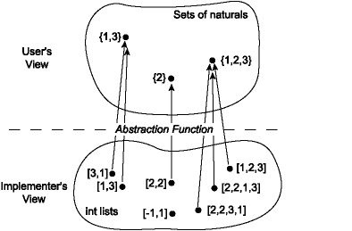
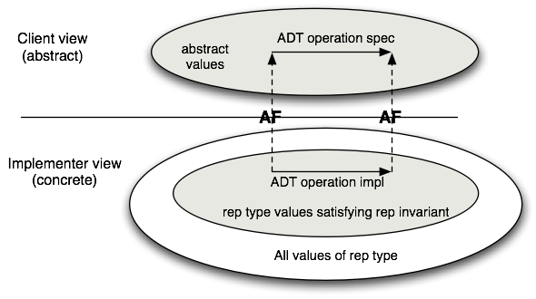
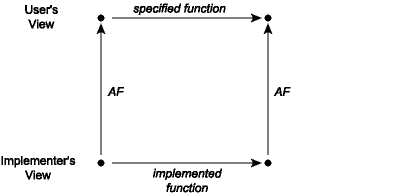
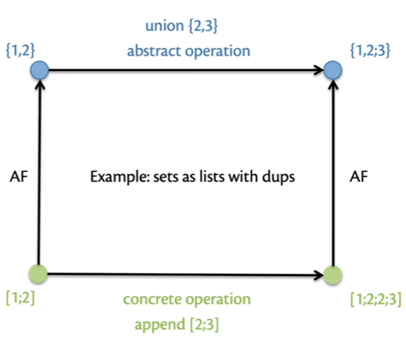

# OCaml (Cornell CS3110 Part2)

# Ch6. Correctness

## 6.1 Abstraction and Specification

**what is Abstraction**

- ( verb abstract) *Forgetting information, so that different things can be treated as the same*

- ( noun ) *Artifacts that result from that process*

**what is Specification**

- ( verb specify ) *The act of creating such an artifact*
- ( noun ) *Intended behavior of abstraction*

**Audience of specification**

- Clients
  - What they must guarantee (preconditions) : Clients must guarantee the input of certain function
  - What they can assume (postconditions) : Clients can assume the output of certain function

- Implementers

  - What they can assume (preconditions) : Implementers can assume the input of certain function

  - What they must guarantee (postconditions) : Implementers must guarantee the output of certain function

**Benefits of specification**

- Locality : understand abstraction without needing to read implementation
- Modifiablility : change implementation without breaking client code
- Accountability : clarify who is to blame

**Satisfaction**

An implementation satisfies a specification if it provides the described behavior

Many implementations can statisfy the same specification

- Client has to assume it could be any of them
- Implementer gets to pick one

But both should act in good faith

**Factors creating amiguity**

- The client didn't understand what they wanted you to implement
- The client genuinely didn't care something they don't understand
- You didn't understand the meaning of some piece

What strategies might you follow in the future when you encounter ambiguous speces ?

**What if spec is ambiguous ?**

Ambiguity is the fact of life.

Do the most reasonable thing you can. For example if client violates the specs, you can do anything you can, but it is not a good choice to put your computer on fire 😂.

## 6.2 Function Specifications

**Template**

```ocaml
(** [f x] is ...
	example: ...
	Requires: ...
	Raises: ... *)
val f : t -> u
```

The specification is written in a .ml file above the decalaration

**Library specification**

see specs from [OCaml library : List](https://ocaml.org/manual/5.2/api/List.html) : 

---

```ocaml
val sort : ('a -> 'a -> int) -> 'a list -> 'a list
```

Sort a list in increasing order according to a comparison function[1]. The comparison function must return 0 if its arguments compare as equal, a positive integer if the first is greater, and a negative integer if the first is smaller (see Array.sort for a complete specification). For example, [`compare`](https://ocaml.org/manual/5.2/api/Stdlib.html#VALcompare) is a suitable comparison function.[2] The resulting list is sorted in increasing order.[3] [`List.sort`](https://ocaml.org/manual/5.2/api/List.html#VALsort) is guaranteed to run in constant heap space (in addition to the size of the result list) and logarithmic stack space.[4]

The current implementation uses Merge Sort. It runs in constant heap space and logarithmic stack space.

---

- [1] **One-line summary of behavior**
- [2] **Precondition** (input of a function should ...)
- [3] **Postcondition** (output of a function should ...)
- [4] **Promise ablout efficiency**

## 6.3 Parts of a Function Specification

### 6.3.1 Requires clause

```ocaml
(** [hd lst] is the head of [lst].
	Requires: [lst] is non-empty. *)
val hd : 'a list -> 'a
```

Precondition: blame client if input is bad

> Note : Types are part of the source code not the preconditon in OCaml

### 6.3.2 Returns clause

```ocaml
(** [sort lst] contains the same elements as [lst], but sorted in ascending order. *)
val sort : int list -> int list
```

Postcondition: blame implmenter if ouputs is bad (unless client violated a precondition)

### 6.3.3 Example clause

```OCAML
(** Example : 
	- [Sort [1;3;2;3]] is [[1;2;3;3]].
	- [sort []] is [[]]. *)
val sort : int list -> int list
```

Super helpful to clarify spec for humans.

### 6.3.4 Raises clause

```ocaml
(** [hd lst] is the head of [lst]. Requires: [lst] is non-empty.
	Raises : [Failure "hd"] if [lst] is empty. *)
val hd : 'a list -> 'a
```

Also a postcondition: behavior implementer must provide.

## 6.4 Data Abstractions

- A ***data abstraction*** is a specification of operations on a set of values
  - e.g. stacks have push, pop, peek, etc.; we don't know what the values concretely are
- A ***data structure*** is an implementation of a data abstraction with a particular representation
  - e.g. ListStack implemented StackSig with 'a list, (::), etc.

## 6.5 Implementing Sets as Lists

```ocaml
(* sets.ml *)

module type Set = sig
  (** ['a t] is the type of a set whose elements have type ['a]. *)
  type 'a t

  (** [empty] is the empty set. *)
  val empty : 'a t

  (** [size s] is the number of elements in [s].
      [size empty] is [0]. *)
  val size : 'a t -> int

  (** [add x s] is a set containing all the elements of [s]
      as well as element [x]. *)
  val add : 'a -> 'a t -> 'a t

  (** [mem x s] is [true] iff [x] is an element of [s]. *)
  val mem : 'a -> 'a t -> bool

  (** [union s1 s2] is the set containing both the elements
  of [s1] and the elements of [s2].*)
  val union : 'a t -> 'a t -> 'a t
end


module ListSetNoDups : Set = struct
  (** The list [a1; ...; an] represents the set {a1, ..., an}.
      The empty list [[]] represents the empty set. The list
      must not contain duplicates. *)
  type 'a t = 'a list

  let empty = []

  let size = List.length

  let mem = List.mem

  let add x s = if mem x s then s else x :: s

  let union s1 s2 = s1 @ s2 |> List.sort_uniq Stdlib.compare
end
```

## 6.6 Another Implementation of Sets

Cont'd 6.5

```ocaml
(* sets.ml *)

(* ... *)

module ListSetDups : Set = struct
  (** The list [a1; ...; an] represents the set {a1, ..., an}.
      The empty list [[]] represents the empty set. The list
      may contain duplicates. *)
  type 'a t = 'a list

  let empty = []

  let mem = List.mem

  let rec size s =
    s |> List.sort_uniq Stdlib.compare |> List.length

  let add = List.cons

  let union = List.append
end
```

## 6.7 Abstraction Functions

- Q : How to interpret the representation type as the data abstraction ?
- A : ***Abstracion function*** (AF)

- Q : How to determine which values of representation type are meaningful ?
- A : ***Representation invariant*** (RI)

***Abstraction function maps valid concrete values to abstract values***



**Document the AF (write it first before implementing operations)**

```ocaml
module ListSetNoDups : Set = struct
(** AF : The list [a1; ...; an] represents the set {a1, ..., an}.
  	The empty list [[]] represents the empty set. 
  	RI : The list must not contain duplicates. *)

module ListSetDups : Set = struct
(** AF : The list [a1; ...; an] represents the set {b1, ..., bm}.
	where [b1; ...; bm] is the same list as [a1; ...; an] but
	with any duplicates removes.
  	The empty list [[]] represents the empty set. 
  	RI : none *)
```

## 6.8 Implementing Abstraction Functions

**Implementing AF by `string`**

```ocaml
(* sets.ml *)
module type Set = sig
  (** ['a t] is the type of a set whose elements have type ['a]. *)
  type 'a t

  (** [empty] is the empty set. *)
  val empty : 'a t

  (** [size s] is the number of elements in [s].
      [size empty] is [0]. *)
  val size : 'a t -> int

  (** [add x s] is a set containing all the elements of [s]
      as well as element [x]. *)
  val add : 'a -> 'a t -> 'a t

  (** [mem x s] is [true] iff [x] is an element of [s]. *)
  val mem : 'a -> 'a t -> bool

  (** [union s1 s2] is the set containing both the elements
  of [s1] and the elements of [s2].*)
  val union : 'a t -> 'a t -> 'a t

  (** [string s] is a representation of [s] as a string, using
   [f] to represent elements as strings *)
  val string : ('a -> string) -> 'a t -> string
end


(** [dedup lst] is [lst] but with duplicates removed. It also
    sorts the output list. *)
let dedup lst = lst |> List.sort_uniq Stdlib.compare

let interior string_of_elt h t =
  t
  |> List.map string_of_elt
  |> List.fold_left (fun acc elt -> acc ^ ", " ^ elt) (string_of_elt h)

let string_of_list string_of_elt = function
  | [] -> "{}"
  | h :: t -> "{" ^ interior string_of_elt h t ^ "}"

module ListSetNoDups : Set = struct
(** AF : The list [a1; ...; an] represents the set {a1, ..., an}.
  	The empty list [[]] represents the empty set. 
  	RI : The list must not contain duplicates. *)
  type 'a t = 'a list

  let empty = []

  let size = List.length

  let mem = List.mem

  let add x s = if mem x s then s else x :: s

  let union s1 s2 = s1 @ s2 |> dedup

  let string f s = s |> dedup |> string_of_list f
end


module ListSetDups : Set = struct
(** AF : The list [a1; ...; an] represents the set {b1, ..., bm}.
	where [b1; ...; bm] is the same list as [a1; ...; an] but
	with any duplicates removes.
  	The empty list [[]] represents the empty set. 
  	RI : none *)
  type 'a t = 'a list

  let empty = []

  let mem = List.mem

  let rec size s =
    s |> dedup |> List.length

  let add = List.cons

  let union = List.append

  let string f s = s |> dedup |> string_of_list f
end
```

Now we can use the AF in utop : 

```ocaml
(* utop *)
ListSetNoDups.(empty |> add 43 |> add 42 |> add 43 |> string string_of_int)
(* - : string = "{42, 43}" *)
```

## 6.9 Representation Invariants

**Rep.invariant distinguished valid concrete values from invalid concrete values**



**Documenting the RI**

- Above rep type in implementation you write : 

  - ```ocaml
    (** AF : comment
    	RI : comment *)
    ```

  - Write it first before implementing operations

**Rep. invariant implicitly part of every precondition and every postcondition in abstraction**

For example every cannot input duplicates element in ListSetNoDups and there is no time it returns an output which contains duplicates, though now that invariant is hidden from the client.

**Invariant may temporarily be violated** 

For example in `module ListSetNoDups ... let union s1 s2 = s1 @ s2 |> dedup`, `s1 @ s2` temporarily violates RI.

## 6.10 Implementing Representation Invariant

**Idiom** : 

- write rep_ok function
- call function on every input and output

**Implement RI in** `module ListSetNoDups`

```ocaml
module type Set = sig
  (** ['a t] is the type of a set whose elements have type ['a]. *)
  type 'a t

  (** [empty] is the empty set. *)
  val empty : 'a t

  (** [size s] is the number of elements in [s].
      [size empty] is [0]. *)
  val size : 'a t -> int

  (** [add x s] is a set containing all the elements of [s]
      as well as element [x]. *)
  val add : 'a -> 'a t -> 'a t

  (** [mem x s] is [true] iff [x] is an element of [s]. *)
  val mem : 'a -> 'a t -> bool

  (** [union s1 s2] is the set containing both the elements
  of [s1] and the elements of [s2].*)
  val union : 'a t -> 'a t -> 'a t

  (** [string s] is a representation of [s] as a string, using
   [f] to represent elements as strings *)
  val string : ('a -> string) -> 'a t -> string
end


(** [dedup lst] is [lst] but with duplicates removed. It also
    sorts the output list. *)
let dedup lst = lst |> List.sort_uniq Stdlib.compare

let interior string_of_elt h t =
  t
  |> List.map string_of_elt
  |> List.fold_left (fun acc elt -> acc ^ ", " ^ elt) (string_of_elt h)

let string_of_list string_of_elt = function
  | [] -> "{}"
  | h :: t -> "{" ^ interior string_of_elt h t ^ "}"

module ListSetNoDups : Set = struct
  (** AF : The list [a1; ...; an] represents the set {a1, ..., an}.
      The empty list [[]] represents the empty set.
      RI : The list must not contain duplicates. *)

  type 'a t = 'a list

  let rep_ok lst = if List.length lst = List.length (dedup lst) then lst else failwith "RI"

  let empty = rep_ok []

  let size s = List.length (rep_ok s)

  let mem x s = List.mem x (rep_ok s)

  let add x s =
    let s = rep_ok s in
    if mem x s then s else x :: s

  let union s1 s2 = (rep_ok s1) @ (rep_ok s2) |> dedup |> rep_ok

  let string f s = string_of_list f (rep_ok s)
end


module ListSetDups : Set = struct
  (** AF : The list [a1; ...; an] represents the set {b1, ..., bm}.
      where [b1; ...; bm] is the same list as [a1; ...; an] but
      with any duplicates removes.
      The empty list [[]] represents the empty set.
      RI : none *)

  type 'a t = 'a list

  let empty = []

  let mem = List.mem

  let rec size s =
    s |> dedup |> List.length

  let add = List.cons

  let union = List.append

  let string f s = s |> dedup |> string_of_list f
end
```

As we saw, rep_ok is too expensive, but sometimes (in other cases rather than set) it is cheap. Or we can make a switch to determain when rep_ok take effects : 

```ocaml
let rep_ok lst = lst
(* if List.length lst = List.length (dedup lst) then lst else failwith "RI" *)
```

## 6.11 Abstraction Functions and Commutative Diagrams

**AF and operations**

Using the abstraction function, we can now talk about what it means for an implementation of an abstraction to be *correct*. It is correct exactly when every operation that takes place in the concrete space makes sense when mapped by the abstraction function into the abstract space. This can be visualized as a *commutative diagram*:

| commutative diagram                       | example in Set                                               |
| ----------------------------------------- | ------------------------------------------------------------ |
|  |  |

**Correctness of operations**

Implementation is correct if AF commutes:
$$
op_{abs}(AF(c))=AF(op_{conc}(c))
$$

## 6.12 Testing and Validation

### 6.12.1 Validation

- **Validation** : does program behave as intended ?
- **Testing** : a process for **validation**
- **Debugging** : determining cause of unintended behavior
- **Defensive programming** : implementation techniques for making **validation** and **debugging** easier

### 6.12.2 Approaches to validation

- **Social**
  - Code reviews
  - Extreme/Pair programming
- **Methodological**
  - Test-driven development
  - Version control
  - Bug tracking
- **Technological**
  - Static analysis ("lint" tools, FindBugs, ...)
  - Fuzzers
- **Mathematical**
  - Type systems
  - Formal verification

***The lower, the more formal***, all of these methods should be used

---

**Testing vs. Valification**

Testing:

- Cost effective
- Guarantee that program is correct on ***tested*** inputs and in ***tested*** environment

Verification:

- expensive
- Guarantee that program is correct on ***all*** inputs and in ***all*** environments

> Dijkstra said : "Rorgram testing can at best show the presence of errors but never their absence."

## 6.13 Bugs

- *bugs, suggests something just wandered in*

- *faults*, which are the result of human errors in software systems, and
- *failures*, which are violations of requirements.

## 6.14 Approaches to Testing

**Testing**

- Goal is to expose existence of faults, so that they can be fixed
- ***Unit testing*** : isolated components
- ***Integration testing*** : combined components
- ***Sytem testing*** : functionality, performance, acceptance, installation

***We focus on Unit testing in CS3110***

---

**Regression testing**

- ***Regression*** : a previously fixed fault is reintroduced into the code
- ***Regression testing*** : running tests against new version of software to ensure no regressions
- If you ever find and fix a fault ...
  - put a test case into your suite for it
  - Run suite frequently to detect regressions

---

**Fun fact**
$$
Pr[undetected\ faults]\ increases\ with\ \#\ of\ detected\ faults\ \ \ [Myers\ 1070,2004]
$$

## 6.15 Black Box vs Glass Box Testing

***Black box testing*** : tester knows nothing about internals of functionality being tested. Just like we cannot see the source code

***Glass box testing*** : tester knows internals of functionality being tested. Just like we can see the source code

## 6.16 Black Box Testing

- Tests are based on the specification
- Advantages: 
  - Tester is not  biased by assumptions made in implementation
  - Tests are robust w.r.t. chages in implementation
  - Tests can be read and evaluated by reviewers who are not implementers
- Main kinds of black box tests:
  - Example inputs provided by spec
  - Typical inputs
    - Common, simple values of a type (int : 1 or 10, char : alphabetic letters)
  - Boundary cases
    - QA Engineer wlks into a bar . Orders a beer. Orders 0 beers. Orders 99999999 beers. Order a lizard. Orders -1 beers. Orders a sdfeljknesv. 😂
    - aka *corner* cases or *edge* cases
    - Atypical or extremal values of a type, and values nearby
      - int : 0, 1, -1, min_int, max_int
      - char  '\000', '\032'(space), '\127'(delete)
      - 'a list: empty list, list with a sigle element, list with enough elements to trigger stack overflow on non-tail-recursive functions. 😱
      - records / tuple : combinations of atypical values
      - variants : all constructors
  - Paths through spec
    - Representative inputs **for classes of ouputs**
    - Representative inputs **for each way of satisfying the precondition**
    - Representative inputs **for each way of raising and not raising exception**

## 6.17 Glass Box Testing

- Advantages : 
  - can determine whether a new test case really yields additional information about correctness of implementation
  - can address likely errors that are not apparent from specification
- **Supplements** black-box testing; does **not replace** examination of specification
- Exact definition of coverage is flexible...

---

**Coverage**

| Kind      | Meaning                                                      |
| --------- | ------------------------------------------------------------ |
| Statement | Evaluate every statement/expression                          |
| Condition | Evaluate every Boolean/pattern match to each possible value  |
| Path      | Cause every possible execution path through program to occur |

e.g.

```ocaml
let max3 x y x = 
	if x > y then
		if x > z then x else z
	else
		if y > z then y else z
```

Testing according to black-box specification might lead to all kinds of inputs

**But** there are really **only 4** paths through implementation ! 😊

- Representatives
  - 3 2 1
  - 3 2 4
  - 1 2 1
  - 1 2 3

---

**Achieving good coverage**

- Include test cases for
  - each branch of each (nested) if expression
  - each branch of each (nested) pattern match
- Paticularly watch out for : 
  - base cases of recursive function
  - recursive calls inrecursive function
  - every place where an exception might be raised

## 6.18 Bisect

**Bisect Tutorial.**

1. Download bisect_ppx and ounit2 `opam update`, `opam install bisect_ppx`, `opam install ounit2`

2. Download the file [sorts.ml](https://cs3110.github.io/textbook/code/sorts.ml) (or copy from below).  You will find an implementation of insertion sort and merge sort.

3. Download the file [test_sorts.ml](https://cs3110.github.io/textbook/code/test_sorts.ml) (or copy from below). It has the skeleton for an OUnit test suite.

4. Create a `dune` file to execute `test_sorts`:

```
(executable
 (name test_sorts)
 (libraries ounit2)
 (instrumentation
  (backend bisect_ppx)))
```

5. Create a `dune-project` file to let dune recognize this is a OCaml project

```
(lang dune 3.6)
```

6. Run:

```bash
$ dune exec --instrument-with bisect_ppx ./test_sorts.exe
```

That will execute the test suite with Bisect coverage enabled, causing some files named `bisectNNNN.coverage` to be produced.

7. Run:

```bash
$ bisect-ppx-report html
```

to generate the Bisect report from your test suite execution. The report is in a newly-created directory named `_coverage`.

8. Open the file `_coverage/index.html` in a web browser. Look at the per-file coverage; you’ll see we’ve managed to test a few percent of `sorts.ml` with our test suite so far. Click on the link in that report for `sorts.ml`. You’ll see that we’ve managed to cover only one line of the source code.

9. There are some additional tests in the test file. Try uncommenting those, as documented in the test file, and increasing your code coverage. Between each run, you will need to delete the `bisectNNNN.coverage` files, otherwise the report will contain information from those previous runs:

```bash
$ rm bisect*.coverage
```

By the time you’re done uncommenting the provided tests, you should be at 25% coverage, including all of the insertion sort implementation. For fun, try adding more tests to get 100% coverage of merge sort.

---

```ocaml
(* sorts.ml *)

(******************************************************************
 * INSERTION SORT
 ******************************************************************)

(** [insert x lst] is a list containing all the elements of [lst] as
    well as [x], sorted according to the built-in operator [>=].
    Requires: [lst] is already sorted according to [<=] *)
let rec insert x = function
  | [] -> [ x ]
  | h :: t -> if h >= x then x :: h :: t else h :: insert x t

(** [ins_sort lst] is [lst] sorted according to the built-in operator [<=].
    Performance: O(n^2) time, where n is the number of elements in [lst].
    Not tail recursive. *)
let rec ins_sort = function [] -> [] | h :: t -> insert h (ins_sort t)

(******************************************************************
 * MERGE SORT
 ******************************************************************)

(** [take k lst] is the first [k] elements of [lst], or just [lst]
    if it has fewer than [k] elements.
    Requires: [k >= 0] *)
let rec take k = function
  | [] -> []
  | h :: t -> if k = 0 then [] else h :: take (k - 1) t

(** [drop k lst] is all but the first [k] elements of [lst], or just []
    if it has fewer than [k] elements.
    Requires: [k >= 0] *)
let rec drop k = function
  | [] -> []
  | _ :: t as lst -> if k = 0 then lst else drop (k - 1) t

(** [merge xs ys] is a list containing all the elements of [xs] as well as [ys],
    in sorted order according to [<=].
    Requires: [xs] and [ys] are both already sorted according to [<=]. *)
let rec merge xs ys =
  match (xs, ys) with
  | [], _ -> ys
  | _, [] -> xs
  | x :: xs', y :: ys' ->
      if x <= y then x :: merge xs' ys else y :: merge xs ys'

(** [merge_sort lst] is [lst] sorted according to the built-in operator [<=].
    Performance: O(n log n) time, where n is the number of elements in [lst].
    Not tail recursive. *)
let rec merge_sort = function
  | [] -> []
  | [ x ] -> [ x ]
  | xs ->
      let k = List.length xs / 2 in
      merge (merge_sort (take k xs)) (merge_sort (drop k xs))
```

---

```ocaml
(* test_sorts.ml *)

open OUnit2
open Sorts

let make func expected_output input _ =
  assert_equal expected_output (func input)

let ins_sort_tests =
  [
    (* first run tests with just this one test uncommented *)
    "ins sort empty list" >:: make ins_sort [] [];
    (* next uncomment just the next test *)
    "ins sort single-element list" >:: make ins_sort [1] [1];

    (* now uncomment the rest of the tests *)
    "ins sort two-element sorted list" >:: make ins_sort [1;2] [1;2];
    "ins sort two-element unsorted list" >:: make ins_sort [1;2] [2;1];
    "ins sort three-element unsorted list" >:: make ins_sort [1;2;3] [3;2;1];

    (* now try adding more glass box tests here *)
  ]

let suite = "test suite for sorts" >::: ins_sort_tests

let _ = run_test_tt_main suite
```

## 6.19 Randomized Testing

### 6.19.1 Random Number Generation

**An Experiment**. Start a new session of utop and enter the following:

```ocmal
# Random.int 100;;
# Random.int 100;;
# Random.int 100;;
```

Each response will be an integer i such that 0~99. But it is ***pseudorandom*** (we will always get the same number each time we start a new session of utop)

**Real Random** 

```
# Random.self_init ();;
# Random.int 100;;
# Random.int 100;;
# Random.int 100;;
```

### 6.19.2 QCheck Abstractions

- intall QCheck : `opam install qcheck`
- load QCheck in utop : `#require "qcheck;;`

**Generators** : One of the key pieces of functionality provided by QCheck is the ability to generate pseudorandom values of various types. Here is some of the signature of the module that does that:

```ocaml
module QCheck : sig
  ...
  module Gen :
  sig
    type 'a t = Random.State.t -> 'a
    val int : int t
    val generate : ?rand:Random.State.t -> n:int -> 'a t -> 'a list
    val generate1 : ?rand:Random.State.t -> 'a t -> 'a
    ...
  end
  ...
end
```

`'a QCheck.Gen.t` is a function that takes in a PRNG state (`Random.State.t`) and uses it to produce a pseudorandom value of type `'a`.

>  How to get `Random.State.t`  value ?
>
> 1. `let state = Random.State.make_self_init ()`
> 2. `let state = Random.State.make [42]`

So `QCheck.Gen.int` produces pseudorandom integers. e.g.

```ocaml
let rsi = Random.State.make_self_init () (* val rsi : Random.State.t = <abstr> *)
```

```ocaml
let gi = QCheck.Gen.int rsi (* gi : int = 400840827167074267 *)
```

The function `generate1` actually does the generation of one pseudorandom value. It takes an optional argument that is a PRNG state; if that argument is not supplied, it uses the default PRNG state. e.g.

```ocaml
let ggi = QCheck.Gen.generate1 QCheck.Gen.int;; (* val ggi : int = -2300106483833167948 *)
```

The function `generate` produces a list of `n` pseudorandom values. e.g.

```ocaml
let ggl = QCheck.Gen.(generate ~n:3 int);; (* val ggl : int list =
  [319405570174627617; -4366115228435446331; -1377555162966194256] *)
```

QCheck implements many producers of pseudorandom values. Here are a few more of them:

```ocaml
module QCheck : sig
  ...
  module Gen :
  sig
    val int : int t
    val small_int : int t
    val int_range : int -> int -> int t
    val list : 'a t -> 'a list t
    val list_size : int t -> 'a t -> 'a list t
    val string : ?gen:char t -> string t
    val small_string : ?gen:char t -> string t
    ...
  end
  ...
end
```

You can [read the documentation](https://c-cube.github.io/qcheck/0.17/qcheck-core/QCheck/Gen/index.html) of those and many others.

**Properties**. It's tempting to think how can QCheck know what the correct output is for each of those random inputs ? QCheck allows us to check whether a *property* of each output holds. A property is a function of type `t -> bool`, for some type `t`, that tells us whether the value of type `t` exhibits some desired characteristic.

Here, for example, are two properties; one that determines whether an integer is even, and another that determines whether a list is sorted in non-decreasing order according to the built-in `<=` operator:

```ocaml
let is_even n = n mod 2 = 0

let rec is_sorted = function
  | [] -> true
  | [_] -> true
  | h1 :: (h2 :: t as t') -> h1 <= h2 && is_sorted t'
```

```ocaml
val is_even : int -> bool = <fun>
```

```ocaml
val is_sorted : 'a list -> bool = <fun>
```

**Arbitraries.** The way we present to QCheck the outputs to be checked is with a value of type `'a QCheck.arbitrary`. This type represents an “arbitrary” value of type `'a`—that is, it has been pseudorandomly chosen as a value that we want to check, and more specifically, to check whether it satisfies a property.

We can create *arbitraries* out of generators using the function `QCheck.make : 'a QCheck.Gen.t -> 'a QCheck.arbitrary`. (Actually that function takes some optional arguments that we elide here.) This isn’t actually the normal way to create arbitraries, but it’s a simple way that will help us understand them; we’ll get to the normal way in a little while. For example, the following expression represents an arbitrary integer:

```ocaml
QCheck.make QCheck.Gen.int (* - : int QCheck.arbitrary =
{QCheck.gen = <fun>; print = None; small = None; shrink = None;
 collect = None; stats = []} *)
```

### 6.19.3 Testing Properties

To construct a QCheck test, we create an `arbitrary` and a `property`, and pass them to `QCheck.Test.make`, whose type can be simplified to:

```ocaml
QCheck.Test.make : 'a QCheck.arbitrary -> ('a -> bool) -> QCheck.Test.t
```

creates a QCheck test that checks whether an arbitrary integer is even : 

```ocaml
let t = QCheck.Test.make (QCheck.make QCheck.Gen.int) is_even (* val t : QCheck.Test.t = QCheck2.Test.Test <abstr> *)
```

run test : 

```ocaml
QCheck_runner.run_tests [t]

(* utop # QCheck_runner.run_tests [t];;

--- Failure --------------------------------------------------------------------

Test anon_test_1 failed (0 shrink steps):

<no printer>
================================================================================
failure (1 tests failed, 0 tests errored, ran 1 tests)
- : int = 1 *)
```

Unfortunately, that output isn’t very informative

### 6.19.4 Informative Output from QCheck

TODO

### 6.19.5 Testing Functions with QCheck

TODO

## 6.20 Debegging

- ***Testing*** reveals a **fault** in program
- ***Debugging*** reveals the **cause** of that fault
- Debugging takes more time than programming
  - So try to get it right the first time !
  - **Try to understand exactly why you think code works before debugging !**

### 6.20.1 Debugging advice

- Follow the ***scientific method*** : 

  1. formulate a falsificable hypothesis

  2. create an experiment that can refute the hypothesis
     - find the simplest possible input that causes fault

  3. run that experiment
  4. keep a lab notebook

- The bug is probably not where you think it is. **So ask yourself where it cannot be**

- **Get someone else to help you**

- **Talk to someone else imaginary. Talk to a stuffy or a pillow if you need to. But get your brain going as if you're trying to explain the problem to another human**.

- If all else if failing, doubt your sanity : **do you have the right compiler ? the right verison of source code ?**

- **Don't debug when angry or tired** : give it a break; come back refreshed.

### 6.20.2 **Defensive Programming**

- **Proactive debugging** : make it easier to detect faults by writing fault-detection code during implementation
- Assert preconditions and (rep) invariants
- Write exhaustive conditions (if / match)

Q : "Isn't this expensive ?"

A : It only seems that way !

## 6.21 Formal Verification

**History**

- In the 1970s, scaled to about tens of LOC
- Now, research projects scale to real software : 
  - CompCert : verified C compiler
  - seL4 : verfied microkernel OS
  - Ynot : verfied DBMS, web services
  - Four color theorem
  - Project Everest : verfied HTTPS stack [in progress]
  - Etc.

- In another 40 years ?

**Our goals**

- Write small, pure functional programs
  - no side effects, mutablity, I/O; always terminating
  - intergers, lists, options, trees
- Prove correctness theorems
  - CS 2800 mathematics: induction, logic
- Be rigorous but not completely formal

## 6.22 Equality of Expressions

**Correctness proof**

- Based on equality between expressions
- When does e = e'
  - Not asking about OCaml Boolean equality
  - Asking whether two pieces of code are equal...

**Equlaity of expressions**
$$
e = e'
$$
*if e and e' evaluate to the same value*

---

***Semantically***

​	41 + 1 = 42

***because***

​	41 + 1 ==> 42

​	42 ==> 42

---

***Semantically***

​	fun x -> x = fun y -> y

***because***

​	for all v, 

​	(fun x -> x) v ==> v

​	(fun y -> y) v ==> v

---

## 6.23 Equational Reasoning

**Example1**

```ocaml
let twice f x = f (f x)
let compose f g x = f (g x)
```

twice h x = h (h x) ( by evaluation )
compose h h x = h (h x) ( by evaluation )
so
twice h x = compose h h x ( by transitivity )

> ***proof format :*** 
>
>   twice h x
>
> = {evaluation}
>
>   h (h x)
>
> = {evaluation}
>
>   compose h h x

**Example2**

```ocaml
let ( << ) = compose
```

we can prove `(f << (g << h))` = `((f << g) << h)` aka

for each x,  `(f << (g << h)) x` = `((f << g) << h) x`

## 6.24 Inductive Proofs about Recursive Functions

**Example: even**

```ocaml
let rec even n = 
	match n with
	| 0 -> true
	| 1 -> false
	| i -> even (i - 2)
```

***Proof : by induction***

Claim : for all natural number n, even 2 * n = true

Proof : 

P(n) = even (2 * n) = true

Case: n = 0 

Show even (2 * 0) = true

even (2 * 0) = {evaluate} true;

Case n = k + 1

IH: even (2 * k) = true

Show: even (2 * (k + 1)) = true

even (2 * (k + 1)) = {algebra} even (2 * k + 2) = {evaluation} even (2 * k) = {IH} true

## 6.25 Example Proof - Summation

**Example: Summation**

```ocaml
let rec sumto n = 
	if n = t then 0
	else n + sumto (n - 1)
```

claim: forall natural number n, sumto n = n * (n + 1) / 2

## 6.26 Example Proof - Factorial

**Example: Factorial**

```ocaml
let rec fact n = 
	if n = 0 then 1
	else n * fact (n - 1)
	
let rec facti acc n = 
	if n = 0 then acc else facti (acc * n) (n - 1)
```

claim: for all natural number n, fact n = facti 1 n

## 6.27 Induction on an ADT for Natural Numbers

```ocaml
(* Type [nat] *)
type nat = 
| Z
| S of nat
(* AF: Number of S's is the natural number represented
   e.g. Z rep 0
   		S Z rep 1
   		S (S Z) rep 2
   		S (S (S Z)) rep 3
   		etc. *)

(* Operations on [nat] *)
let rec plus a b = match a with
	| Z -> b
	| S k -> S (plus k b)

let rec mult a b = match a with
	| Z -> Z
	| S k -> plus b (mult k b)
```

claim: forall natural number n, plus n Z = n.

## 6.28 Induction on Lists

```ocaml
let rec (@) lst1 lst2 = 
	match lst1 with
	| [] -> lst2
	| h :: t -> h :: append t lst2
```

claim: forall lst, lst @ [] = lst

## 6.29 Example Proof - List Length

```ocaml
let rec length = function
| [] -> 0
| _ :: t -> 1 + length t

let rec (@) lst1 lst2 = match lst1 with
| [] -> lst2
| h :: t -> h :: (t @ lst2)
```

claim: forall xs ys, length (xs @ ys) = length xs + length ys

## 6.30 Induction on Trees

```ocaml
type 'a tree = 
| Leaf
| Node of 'a tree * 'a * 'a tree
(* note that rather Leaf or Node with TWO subtree 
(no cases that a Node with ONE subtree) *)

let rec nodes = function
| Leaf -> 0
| Node (l, _, r) -> 1 + nodes l + nodes r

let rec leaves = function
| Leaf -> 1
| Node (l, _, r) -> leave l + leaves r
```

claim: forall t, leaves t = 1 + nodes t

## 6.31 Example Proof - Preorder and Length

```ocaml
let rec size = function
| Leaf -> 0
| Node (l, _, r) -> 1 + size l + size r

let rec preorder = function
| Leaf -> []
| Node (l, v, r) -> [v] @ preorder l @ preorder r
```

claim: forall t, length (preorder t) = size t

## 6.32 Induction and Recursion

|                      | Proofs         | Programs                    |
| -------------------- | -------------- | --------------------------- |
| Per constructor ...  | One proof case | One pattern-matching branch |
| On smaller value ... | Use IH         | Make recursive call         |

***Inductive proofs are like recursive programs***

## 6.33 Total Correctness

**Partial correctness:**

**if** a program terminates, then its output is correct

**Total correctness:**

The program terminates, **and** its output is correct 

= partial correctness + termination

**Termination is hard to prove**

- There cannot exist a **general** algorithm that decides whether other algorithms terminate [Alan Turing 1936]

**Heuristic for recursive functions**

A recursive function terminates if:

- All recursive calls are on a "smaller" input, and
- All base cases are terminating.

## 6.34 Equational specification of Stacks

**Equational sepcification aka algebraic specification** (because it's kind of similar to the equation you see in an algebra class)

Cont'd 5.11

1. `is empty empty = true`
2. `is empty (push x s) = false`
3. `peek (push x s) = x`
4. `pop (push x s) = s`

***Every equation shows how to simplify an expression***

e.g. `peek (pop (push 1 (push 2 empty))) = 2`

**Stack implementation, as list**

```ocaml
module Stack = struct
	type 'a t = 'a list
	let empty = []
	let is_empty = []
	let peek = List.hd
	let push = List.cons
	let pop = List.tl
end
(* All of our equations hold simply "by evaluation" for this implementation *)

(* Example proof : eq 4 
	pop (push x s)
= {eval push and pop}
	tl (x :: s)
= {eval tl}
	s	*)
```

## 6.35 Equational specification of Queues

TODO

## 6.36 Design of Equations

### 6.36.1 Canonical form

> *canonical* : conforming to some rule

Two ways to only build up a data structure (stack with element 2) 

- Not canonical : pop (push 1 (push 2 empty))
- Canonical : push 2 empty

⭐**Every value of data structure can be created solely with operations that create canonical forms**

### 6.36.2 Categories of operations

- **Generators** are those operations involved in creating a canonical form. They return a value of the data structure type. For example, `empty`, `push`, `enq`.
- **Manipulators** are operations that create a value of the data structure type, but are not needed to create canonical forms. For example, `pop`, `deq`.
- **Queries** do not return a value of the data structure type. For example, `is_empty`, `peek`, `front`.

```ocaml
(* Stack example *)
module type Stack = sig
	type 'a t
	val empty : 'a t (* generator *)
	val is_empty : 'a t -> bool (* query *)
	val peek : 'a t -> 'a (* query *)
	val push : 'a -> 'a t -> 'a t (* generator *)
	val pop : 'a t -> 'a t (* manipulator *)
end
```

### 6.36.3 Designing equations

`{queries, manipulators} x {generators}` 

In `Stack` (see 5.11), we will get

1. `is empty empty = true`
2. `is empty (push x s) = false`
3. `peek (push x s) = x`
4. `pop (push x s) = s`

In `Set` (see 6.5), we will get

1. `is_empty empty = true`
2. `is_empty (add x s) = false`
3. `mem x empty = false`
4. `mem y (add x s) = true if x = y`
5. `mem y (add x s) = mem y s if x <> y`
6. `remove x empty = empty`
7. `remove y (add x s) = remove y s if x = y`
8. `remove y (add x s) = add x (remove y s) if x <> y`

*for 8. RHS of eqn applies non-generator to smaller input than LHS. That's why we say we simplify the expression*

# Ch7. Mutablility

## 7.1 Refs

- Aka "ref" or "ref cell"
- Pointer to a **typed location** in memory
- Binding of varible to pointer: **immutable**
- Contents of memory location: **mutable**

```ocaml
(* utop *)
(* type in utop line by line seperated by ;; *)

let y = ref 3110; (* val y : int ref = {contents = 3110} *)
y (* - : int ref = {contents = 3110} *)
!y (* - : int = 3110 *)
y := 2110 (* - : unit = () *)
y (* - : int ref = {contents = 2110} *)
!y (* - : int = 2110 *)

(* y is immutable, !y is mutable *)
```

## 7.2 Syntax and Semantics and Refs

**Syntax**

`ref e`

**Evaluation**

- Evaluate `e` to a value `v`
- Allocate a new location `loc` in memory to hold v
- Store `v` in `loc`
- Return `loc`

**Type checking**

- New type constructor: `t ref` where `t` is a type
  - Note: `ref` is used as keyword in type and as keyword in value
- `ref e : t ref` if `e : t` where `t` is a type and `e` is a value


# Ch8. Data Structures


# Ch9. Interpreters

