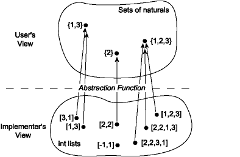
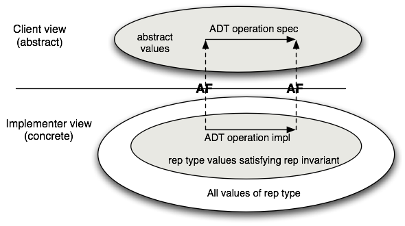
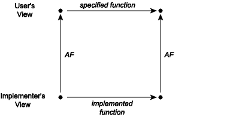

# OCaml Programming [Cornell CS3110]

# Ch0 OCaml build (the build example of 8.3

1. preparation

```shell
$ sudo apt-get install opam
$ opam init
$ opam switch list
#  switch   compiler      description
→  default  ocaml.4.13.1  default
$ echo 'eval $(opam env)' >> ~/.bashrc
```

2. proj init

```shell
$ dune init proj maps
Entering directory '/home/ljh/OCaml-tutorial/CS3110/Ch8/maps'
Success: initialized project component named maps
```

3. proj structure

```shell
$cd maps && tree -L 2
├── _build
│   └── log
├── bin
│   ├── dune
│   └── main.ml
├── dune-project
├── maps.opam
├── lib
│   └── dune
└── test
    ├── dune
    └── test_maps.ml
```

- `lib` and `bin` contain source code files, for libraries and programs, respectively.
- All the build artifacts, and a copy of sources, are stored in the _build directory. Don't touch it.

4. edit `lib/maps.ml` and `test/maps_test.ml` (see in 8.3)
5. edit `test/dune`:

```dune
(test	 					; declare this is a test object
 (name maps_test)			; test executable name is `maps_test.exe`
 (libraries ounit2 maps))	; `ounit2` (test framwork) and `maps`(defined in proj)
 (modules maps_test))		; specify the needed module name is `maps_test.ml`
```

6. edit `lib/dune`:

```
(library					; decalare this is a library object
 (name maps)				; library name
 (modules maps))			; specify the needed module name is `maps.ml`
```

7. edit `bin/dune`:

```
(executable					; declare this is a executable object
 (public_name maps)			; give chance to use `dune exec maps` to execute the excutable
 (name main)				; module name is `main.ml`, executable name is `main.exe`
 (libraries maps))			; depended lib name is `maps`
```

- `name` is name of main module (e.g. main.ml)
- `public_name` is the public name of executable (e.g. maps)
- if no `public_name`, it only can execute by `dune exec ./main.exe`

8. `dune build` then  `dune runtest`(test) and `dune exec maps`(exec)

# Ch2. The Basics of OCaml

## 2.1 Expressions

Every expression has : 

**Semantics :** 

- Type-checking rules (***static semantics***) : produce a type or fail with an error message
- Evaluation rules (***dynamic semantics***) : produce a value, or exception or infinite loop

> ***Static*** refers to the state of a program before it is executed. For example, any operations performed by the compiler on a program that has not yet run are considered static.

In OCaml, all values are expressions, but the reverse is not true. (by now)

Note it must be `+.` in float and `+` in int.

## 2.2 If Expressions

> `==>` 	pronounced evaluate to
>
> `:` 	      pronounced  has type

You can use expressions like (32 : int) to explicitly prompt the compiler to perform type checking and ensure that a variable matches the programmer's intended type. Note that this operation is merely an annotation, not a type conversion.

***if expression*** : 

`if e1 then e2 else e3`

`e1` must be bool, `e2` and `e3` must be the same type.

## 2.3 Let Definitions

`let x = 32 (* binds 32 to x *)`. Unlike in imperative programming, the value of `x` cannot be changed, which is an important characteristic of functional programming.

You can also write let `(y : int) = 31`, where `(y : int)` is merely a type annotation provided by the programmer, not a type conversion. The parentheses can be omitted, allowing a shorter form: `let y : int = 32`.

**A definitions gives a name to a value**

**Definitons are not expressions, or vice-versa**

**But definitions syntactically contain expressions**

**Syntax :** 

`let x = e`

where x is an ***identifier (NOT variable)***

identifier must start with a lowercase letter.

**Evaluation:**

Evaluate `e` to value `v`, then

Bind `v` to `x`: henceforth, `x` will evaluate to `v`

let definition IS NOT expression, Vice versa.

## 2.4 Let Expressions

An interesting usage make ***let*** convert to ***expressions*** : let a = 0 in a;;  bind 0 to a and evaluate a. another example : `let b = 2 in 2 * b`

Out of ***let*** Expression, ***let*** defintion become invalid. That's saying after `let a = 0 in a`,  `let a = 0` become invalid.

## 2.5 Variable Expressions and Scope

### 2.5.1 let definitions toplevel

`let x = e` is implicitly, "in rest of what you type",  e.g.

```ocaml
let a = "big";;
let b = "red";;
let c = a ^ b;;
(* toplevel understands as: *)
let a = "big" in
let b = "red" in
let c = a ^ b in ..
```

## 2.6 Scope and the Toplevel

"An interesting phenomenon."

```ocaml
let x = 1
let x = 2
(* val x : int = 2 *)
```

It seems like the value of x has been changed (which contradicts the idea of functional programming?), but in reality, the above code is equivalent to

```ocaml
let x = 1 in (*allocate memory that always 1*)
	let x = 2 in (*allocate memory that always 1*)
		x
```

In reality, when the outer let x = 1 is executed, the inner computation has already finished, and the inner `let x = 2` disappears. The above code effectively becomes `let x = 1 in 2`.

## 2.7 Anonymous Functions

`fun x -> x + 1` define an anonymous function, invoke this : `(fun x -> x + 1) 30`

## 2.8 Lambdas

### 2.8.1 Anonymous function expression

**Syntax**: `fun x1 ... xn -> e (* fun is keyword in OCaml* )`

### 2.8.2 Functions are values

***Can use them anywhere we use values:***

- functions can take functions as arguments
- functions can return functions as results

## 2.9 Function application

Syntax: `e0 e1 ... en`

No parentheses are needed unless you need to explicitly change the order of evaluation.

Evaluation of `e0 e1 … en`:

1. Evaluate subexpressions:

   `e0 ==> v0, ..., en ==> vn`

   `v0` must be a function:

   `fun x1 ... xn -> e`

2. substitute `vi` for `xi` in `e` yielding new expression `e'`. evaluate it : `e' ==> v`

3. result is `v`

e.g.

from

`(fun x y -> x + y) (2 + 3) 8`

to
`(fun x y -> x + y) 5 8`

to
`5 + 8`

to
`13`

## 2.10 Named Functions

`let inc = fun x -> x + 1`

*is equivalent to*

`let inc x = x + 1;;`

The above two ways are equivalent. Later is syntactic sugar

> not necessary, but make language "sweeter"

another syntactic sugar : 

`(fun x -> x + 1) 2;;`

is equivalent to

`let x = 2 in x + 1;;`

The above two ways are equivalent. Later is syntactic sugar

or do this : 

`let f x y = x - y in f 3 2;;`

## 2.11 Recursive Functions

OCaml explicitly declare recursive function : 

let rec f …

## 2.12 Function Types

Type `t -> u` is the type of a function that takes input of type `t` and returns output of type `u`

Type `t1 -> t2 -> u` is the type of a fucntion that takes input of type `t1` and another input of type `t2` and returns output of type `u`

Note dual purpose for  `->` syntax : 

- function types
- functions values (e.g.  `fun x -> x + 1`, arrow points to value )

## 2.13 Partial Application

type in utop :

`let add x y = x + y;; (*  val add : int -> int -> int = <fun> *)`

`add 3;; (* - : int -> int = <fun> *)`

`let add3 y = add 3;; (* bind fun to add3 *)`

`add3 4;;  (* - : int = 7 *) `

### 2.14.1 More syntactic sugar

***Multi-argument functions do not exist !!!***

`fun x y -> e`

*is syntactic sugar for* 

`fun x -> (fun y -> e)`

*e.g.*

`fun x y -> x + y` 

*is syntactic sugar for*

`fun x -> fun y -> x + y`

***SO, FUNCTIONS ARE VALUES !***

## 2.13 Polymorphic Functions

### 2.13.1 Type variables

**Variable** : name standing for unknown value

**Type variable** : name standing for unknown type

Cpp example : `std::vector<T>`

OCaml Syntax : single quote followed by identifier

e.g. `'foo`, `'key`, `'value`

But most often simply just : `'a` (pronounced alpha), `'b` (pronounced beta)

### 2.13.2 Polymorphism

- *poly =* many*, morph =* form
- write function that works for many arguments regardless of their type
- colsely related to C++ template instantiation

## 2.14 Operators As Functions

`1 + 2` 

Equivalent to

`( + ) 1 2`

we can define our own Operator, e.g.

`let ( <^> ) x y = max x y`

usage : `1 <^> 3`

## 2.15 Application Operator

Application:

`let ( @@ ) f x = f x`

Reverse application:

`let ( |> ) x f = f x`

aka pipline

OCaml defined that :

`f @@ x` is equivalent to `f x` 

and

`x |> f` is equivalent to `f x`

# Ch3. Data and Type

## 3.1 Lists

`[] (* is 'a list *)`

`[1] (* is int list *)`

`[1;2;3;] (* is int list *)`

`[[2;3];[3;4]] (* is int list list *)`

type pronounced from right to left : `[[2;3];[3;4]]` is a list of list of int

operator `::` is used to concat `'a` and `'a list`

### 3.1.1 OCaml lists

- Immutable : cannot change elements. **All you can do is construct new lists out of old lists !**
- Singly-linked:
  - Good for sequential access of short-to-medium length lists
  - Data structures are tools: none is perfect
  - we'll study the implementation later

## 3.2 List Syntax and Semantics

**Syntax:**

- `[]` is the empty list which is pronounced "nil"

- `e1 :: e2` prepends element `e1` to `list e2`. `::` is pronounced "cons"
- `[e1; e2]` is sugar for `e1 :: e2 :: []`
- And similarly for longer lists `[e1; e2; e3]` etc.

**Evaluation:**

- `[]` is a value
- To evaluate `e1 :: e2`,
  - evaluate `e1` to value `v1`,
  - evaluate `e2` to a (list) value `v2`, and
  - return `v1 :: v2`

### 3.2.1 List types

for any type t, the type t list describes lists where all elements have type t

- `[1;2;3] (* int list *)`
- `[true] (* bool list *)`
- `[[1 + 1; 2 - 3];[3 * 7]] (* int list list *)`

## 3.3 Records and Tuples

**A record is an aggregation of named elements, while a tuple is an aggregation of unnamed elements.**

**define a record type** : 

```ocaml
type student = {
    name : string;
    year : int;
}
```

use record type : 

```ocaml
let ljh = {
    name = "liujunhui";
    year = 2001;
}
```

Or, if you want to explicitly perform type checking : 

```ocaml
let ljh : student = {
    name = "liujunhui";
    year = 2001;
}
```

> execute xxx.ml : `type #use "xxx.m";;` in utop

by `ljh.name` to access the content of `name` field of record `student`

**define a tuple type** : 

```ocaml
type time = int * int * string
```

use tuple type : 

```ocaml
let t : time = (10, 10, "am") (* utop shows type time *)
let s = (10, 10, "am") (* utop shows type int * int * string *)
```

## 3.4 Comparsion of Data Type

- length
  - unbounded : List
  - bounded :
    - access by posisiton : Tuple
    - access by name : Record

## 3.5 Record Syntax and Semantics

**Records and tuples**

- **new kind of definition : type definition**
- **new kinds of types : record types, tuple types**

---

**Record syntax**

- `type t = {f1 : t1; f2 : t2}` define a record type `t`, `f1`, `f2` are fields and `t1`, `t2` are types

- `{f1 = e1; f2 = e2}` is a record with fields named f1 and f2
  - Order of fields is irrelevant
  - any number of fields permitted from 1 upto about 4 million
- e.g. accesses field `f` of a record expression `e` : `e.f`
- ***Field names are identifiers not expressions***

---

**Record semantics**

**Evaluation**

- If ei ==> vi then {f1 = e1; ...; fn = en} ==> {f1 = v1; ...; fn = vn}
- If e ==> {…; f = v; …} then e.f ==> v

**Type checking**

- Record types must be defined before use so that OCaml knows the field names
- if ei : ti and t is defined to be {f1 : t1, …, fn : tn}, then {f1 = e1; …; fn = en} : t
- if e : t and if t is defined to be {…; f : tf; …}, then e.f : tf

**Record copy**

{e with f1 = e1} creates a copy of record e with new field value for f1

- this is not mutation : original record unchanged
- can have multiple new field values:
  - {e with f1 = e1; f2 = e2; f3 = e3} etc.
- sugar for {f1 = e1; …; fn = en; g1 = e.g1; …; gm = e.gm} where gi are the fields of e that are not named in the copy
- cannot "add" new fields : type cannot change

## 3.6 Tuples Syntax and Semantics

**Tuple Syntax**

- `(e1, e2, e3)` is a tuple

- `type t = t1 * t2` defines a tuple type, `t1` and `t2` are types (can be different)

- Order of components is relevant

**Evaluation** 

If `ei` ==> `vi`

then `(e1, ..., en)` ==> `(v1, ..., vn)`

**Type checking ** 

If `ei : ti`

then `(e1, ..., en)` : `t1 * ... * tn`

## 3.7 Pattern Matching

```ocaml
match not true with | true -> "nope" | false -> "yep" (* - : string = "yep" *)

match 32 with foo -> foo + 1 (* - : int = 33*)

match "foo" with | "bar" -> 0 | _ ->1 (* - : int = 1 *)

match [] with | [] -> "empty" | _ -> "not empty" (* - : string *)

(* note pattern matching all data type pointed by -> should be the same. e.g. *)

match ["liu"; "junhui"] with | [] -> "empty" | a :: b -> a (* - : string = "liu" *)

match ["liu"; "junhui"] with | [] -> ["empty"] | a :: b -> b (* - : string list = ["junhui"] *)

(* pattern matching can match record. e.g. *)

type student = {name : string; year : int}

let ljh = {name = "liujunhui"; year = 2001}

let name_with_year s = match s with | {name; year} -> name ^ (string_of_int year)
```

## 3.8 Pattern Matching With Lists

A list can only be:

- nil, or
- the cons of an element onto another list

Use **pattern matching** to access list in one of those ways : 

```ocaml
let empty lst = 
    match lst with
    | [] -> true
	| _ -> false (* _::_ or h::t *)
```

---

```ocaml
let rec sum lst = 
    match lst with
    | [] -> 0
    | h :: t -> h + (sum t)
```

> tips : use #trace sum;; can trace function invocation stack. #untrace sum;; to cancel trace

---

```ocaml
let rec length lst = 
    match lst with
    | [] -> 0
    | h :: t -> 1 + (length t)
```

---

```ocaml
(* example usage : append [1;2;3] [4;5;6] is [1;2;3;4;5;6]
   accually is what (@) operator do *)
let rec append lst1 lst2 = 
    match lst1 with
        | [] -> lst2
        | h :: t -> h :: (append t lst2)
```

## 3.9 The `function` Keyword

*Immediately matching against implicit final argument is so useful there's sugar for it*

```ocaml
let f x y z =
    match z with
    | p1 -> e1
    | p2 -> e2
```

*Can be written*

```ocaml
let f x y = function
    | p1 -> e1
    | p2 -> e2
```

e.g.

```ocaml
let rec length lst = 
    match lst with
    | [] -> 0
    | h :: t -> 1 + (length t)
```

*Can be written*

```ocaml
let rec length = function
    | [] -> 0
    | h :: t -> 1 + (length t)
```

## 3.10 `::` vs `@`

- `::`
  - "cons"
  - Add an element onto the head of a list
  - `'a -> 'a list -> 'a list`
  - Constant time : O(1)
- `@`
  - "append"
  - Combine two lists
  - `'a list -> 'a list -> 'a list`
  - Linear time in first list : for lst1 @ lst2, it's O(length lst1)

## 3.11 Pattern Matching Syntax and Semantics

**Syntax :** 

```ocaml
match e with
| p1 -> e1 (* branch1 *)
| p2 -> e2 (* branch2 *)
| ...
| p2 -> en (* branch n *)
```

Can have more branches, or even just one

p is a new syntactic class : ***pattern expressions***

### 3.11.1 Match expressions

**Evaluations** :

- if `e` ==> `v`
  - and `pi` is the first pattern, top-to-bottom, that matches `v`
  - and `ei` ==> `vi`
  - then `(match e ... )` ==> `vi`
- but if no pattern match, raise an `exception Match_failure`

**Type-checking** : 

if `e` and `pi` have type `ta` and `ei` have type `tb` then entire match expression has type `tb`

### 3.11.2 Basic pattern syntax

- `x` i.e. any identifier
- `_` i.e. underscore
- any constant

### 3.11.3 Semantics of pattern matching

- A constant matches itself
- An identifier aka pattern variable matches anything and binds it in the scope of the branch
- The underscore aka wilcard matches anything but doesn't bind it

### 3.11.4 Data type patterns

- `[]`
- `p1 :: p2` etc.
- `[p1; p2]` etc.
- `(p1, p2)` etc.
- `{f1 = p1; f2 = p2}` etc.

All of which match the corresponding data type values, and can bind parts of them

## 3.12 Static Checking of Pattern Matching

OCaml's static checking is not only type checking

e.g.

```ocaml
let bad_empty lst = 
    match lst with
    | [] -> true
```

This coverage of space of possible shapes that this data could take is not exhaustive; simply say we've left out a branch which maybe cause Match_failure exception at runtime. Luckily OCaml's static checking will detect it.

---

```ocaml
let rec bad_sum lst = 
    match lst with
    | h :: t -> h + bad_sum t
    | [x] -> x (* branch2 *)
    | [] -> 0
```

OCaml compiler will detect branch 2 will never been enter

---

```ocaml
let rec bud_sum' lst = 
    List.hd lst + bad_sum' (List.tl lst)
```

List.hd and List.tl are from list standard library. List.hd [1;2;3];; returns 1 : int and List.tl [1;2;3];; returns [2;3] : int list. OCaml complier will **not** detect that something wrong because the risk of error depends on standard library fun

### 3.12.1 Compiler check for your errors

- Static semantics is more than just type checking
- OCaml compiler checks for
  - Exhaustiveness of patterns
  - Unused branches
- Do not ignore those warnings — the compiler is finding your errors and giving you a chance to fix them !!

## 3.13 Variants

```ocaml
type point = float * float (* **tuple** *)
type primary_color = Red | Green | Blue (* **varient** like **enumerate** *)
type shape = Circle of {center  : point; radius : float} | Rectangle of {lower_left : point; upper_right : point}
let r (* : primary_color *) = Red
let c1 = Circle {center = (0., 0.); radius = 1.}
let r1 = Rectangle {lower_left = (-1., -1.); upper_right = (1., 1.)}
```

## 3.14 Pattern Matching with Variants Part 1

> In OCaml, ***constructor*** is used in variant types and record types to create concrete data type instance. For example, in type color = Red | Green | Blue, **Red, Green and Blue are constructor**. Or in type shape = Circle of float | Rectangle of float * float, **Cirle and Rectangle are also constructors but they need parameters** (let s = Circle 10.  ;;  let s2 = Rectangle (5., 8.);; )

3.13 cont'd

```ocaml
let avg a b = (a +. b)  /. 2.
let center s = match s with Circle {center; radius} -> center | Rectangle {lower_left; upper_right} -> let (x_ll, y_ll) = lower_left in let (x_ur, y_ur) = upper_right in (avg x_ll x_ur, avg y_ll y_ur)
```

## 3.15 Pattern Matching with Variants Part 2

we can modify 

```ocaml
let center s = match s with Circle {center; radius} -> center | Rectangle {lower_left; upper_right} -> let (x_ll, y_ll) = lower_left in let (x_ur, y_ur) = upper_right in (avg x_ll x_ur, avg y_ll y_ur)
```

to

```ocaml
let center s = match s with Circle {center; radius} -> center | Rectangle {lower_left = (x_ll, y_ll); upper_right = (x_ur, y_ur} -> (avg x_ll x_ur, avg y_ll y_ur)
```

## 3.16 Variant Syntax and Semantics

**Type definiation syntax** : 

```ocaml
type t = 
| C1 of t1
| ...
| Cn of tn
```

where `Ci` is **Constructors aka tags**, ti is Optional data carried by constructor

> OCaml requires Constructors names must to be capitalized

### 3.16.1 Non-constant variant expressions

**Syntax :** `C e`

**Evaluation :** 

if `e` ==> `v` then `C e` ==> `C v`

**Type checking :** 

`C e : t`

if `t = ...| C of t' | ...` and `e : t'`

**Pattern matching :** 

`C p` is a pattern

**for example :** 

```ocaml
type point = float * float (* **tuple** *)
type shape = Circle of {center  : point; radius : float} | Rectangle of {lower_left : point; upper_right : point}
let c1 : shape = Circle {center = (0., 0.); radius = 1.}
```

### 3.16.2 Constant variant expressions

**Syntax :** `C e`

**Evaluation :** already a value

**Type checking :** 

`C e : t`

if `t = ... | C | ...` 

**Pattern matching :** 

`C` is a pattern

## 3.17 Algebraic Data Type

when we model the real world, we will use variant when we use OR and record when AND. 

- Records and tuples : each-of types
  - aka **product** types
- Variants : one-of types
  - aka **sum** types
  - **aka tagged union**

### 3.17.1 Algebraic Data Type (Records and Vriants)

- Sums and product : algebra
- Hence variants known as algebraic data types (ADT)
- ADT also stands for abstract data type

## 3.18 An ADT for Pokemon

**A feature in OCaml :** 

```ocaml
type ptype = Normal | Fire | Water
type peff = Normal | NotVery | Super
let x = Normal (* this refers to the last Normal constructor because ***definition shadow*** in OCaml *)
```

---

**An idiomatic way to solve that (we can do better after leaning *module* in OCaml) :**

```ocaml
type ptype = TNormal | TFire | TWater
type peff = ENormal | ENotVery | ESuper
let mult_of_eff = function ENormal -> 1.0 | ENotVery -> 0.5 | ESuper -> 2.0
(* let mult_of_eff p = match p with ENormal -> 1.0 | ENotVery -> 0.5 | ESuper -> 2.0 *)
let eff = function
| (TFire, TFire) ->ENotVery
| (TWater, TWater) ->ENotVery
| (TFire, TWater) -> ENotVery
| (TWater, TFire) -> ESuper
| _ -> ENormal
```

## 3.19 Recursive Parameterized Variants

---

```ocaml
type intlist = Nil | Cons of int * intlist
let rec length = function Nil -> 0 | Cons (_, t) -> 1 + length t
```

---

*but when we need stringlist, must we paste code and rename fun length ? NO ! We can do like this :* 

```ocaml
type 'a mylist = Nil | Cons of 'a * 'a mylist
let rec length = function Nil -> 0 | Cons (_, t) -> 1 + length t
```

---

*By the way, we actually could get some nicer syntax for our lists :* 

```ocaml
type 'a mylist = [] | (::) of 'a * 'a mylist
let rec length = function [] -> 0 | _ :: t -> 1 + length t
```

**This is OCaml list implementation**

- **'a list** is a **type constructor** parameterized on **type vaiable 'a**
- `[]` and `::` are constructors

## 3.20 Option : A built-in variant

**options are build-in variant in the OCaml standard library :** 

`type 'a option = None | Some of 'a`

*type in utop :* 

`None (* - : a option = None *)`

`Some 1 (* - : int option = Some 1 *)`

`Some [1;2;3] (* - : int list option = Some [1; 2; 3] *)`

---

*we can define  a fun to extract 'a option -> 'a :* 

```ocaml
let get_val o = match o with None -> failwith "??" | Some x -> x
```

---

*because is None we don't know what 'a to return, how to solve it ? Add a parameter default :* 

```ocaml
let get_val default o = match o with None -> default | Some x -> x (* val get_val : 'a -> 'a option -> 'a = <fun> *)
```

---

***something practical :*** 

```ocaml
let rec list_max (lst : 'a list) : 'a option = 
    match lst with
    | h :: t -> begin
        match list_max t with 
        | None -> Some h
        | Some m -> Some (max h m)
    end
    | [] -> None
```

> `begin ... end` is same as `(...)` but is more **striking** for programmers

## 3.21 Exceptions : extensible variants

`#show exn;; (* type exn = .. *)`

**Provide constructors (`exception` is a keyword to define exceptions. exception inherit from exn)**

```ocaml
exception ABadThing
exception OhNo of string
```

**Use this**

```ocaml
OhNo "oops"
```

---

**Type *exn* is a build-in *extensible* variant**

***Normally when we define variants, we have to list all of the constructors right there as part of the definition**. exn allows us to **provide the constructors later on** with that keyword :* 

```ocaml
exception OhNo of string (* we should provide the constructor OhNo like this *)
OhNo "oops" (* use like this after provide exception OhNo *)
```

---

**Relation between `exn` and `exception`**

- Type `exn` is a build-in **extensible** variant
- Add new constructors to it with `exception`
- Build-in function `raise` : exn -> 'a

---

**Some predefined exceptions :** 

- `exception Failure of string`
  - Exception raised by libraary functions to signal that they are undefined on the given argrments
  - Build-in function `failwith : string -> 'a`
- `exception InvalidArgument of string`
  - Exception raised by library functions to signal that the given argements do not make sense
  - Build-in function `invalid_arg : string -> 'a`

## 3.22 Handing Exceptions

```ocaml
let safe_div x y = 
    try x / y with
        | Division_by_zero -> 0
```

**Syntax** 

```ocaml
try e with
    | p1 -> e1
    | p2 -> e2
```

**Evaluation** 

if `e ==> v` then `(try e ...)` ==> `v`

if e raises an exception x then match x against the patterns if none match reraises x

**Type checking** 

`(try e …) : t`

if `e : t` and `ei : t` and `pi : exn`

## 3.23 Binary Trees

```ocaml
type 'a tree = Leaf | Node of 'a * 'a tree * 'a tree
let t = Node (1, Node (2, Leaf, Leaf), Node(3, Leaf, Leaf))
let rec size = function Leaf -> 0 | Node (_, l, r) ->1 + size l + size r
let rec sum = function Leaf -> 0 | Node (v, l, r) -> v + sum l + sum r
```

***OCaml do this so BRILLIANTLY !***

# Ch4. Higher-Order Programming

## 4.1 Higher-Order Functions

***Recall that FUNCTIONS ARE VALUES !***

- Functions can be used anywhere we use values
- Functions can take functions as arguments
- Functions can return functions as reusults

***So functions are higher-order***

e.g.

```ocaml
let double x = 2 * x
let square x = x * x
let quad x = 4 * x
let quad' x = double (double x)
let quad'' x = x |> double |> double
let fourth x = x * x * x * x
let fourth' x = square (square x)
let fourth'' x = x |> square |> square
```

---

*Note that quad'' and fourth'' have something similar, can we **factor it out** ?*

e.g.

```ocaml
let twice f x = f (f x)
let quad''' x = twice double x
let quad'''' = twice double (* val quad'''' : int -> int = <fun> *)
```

## 4.2 Map

```ocaml
let inc x = x + 1
List.map (fun x -> (inc x) ) [1;2;3] (* bad style *)
(* is equivalent to*)
List.map inc [1;2;3] (* good style *)
```

## 4.3 Implementing Map

```ocaml
let rec add1 = function             [] -> [] | h :: t -> (h + 1) :: add1 t
let rec concat3110 = function [] -> [] | h :: t -> (h ^ "3110") :: concat3110 t
```

---

***factor the similarity out !***

```ocaml
let rec transform f = function [] -> [] | h :: t -> f h :: transform f t (* val transform : ('a -> 'b) -> 'a list -> 'b list = <fun> *)
let add1' y = transform (fun x -> x + 1) y (* val add1' : int list -> int list = <fun> *)
let concat3310' y = transform (fun x -> x ^ "3310") y (* val concat3310' : string list -> string list = <fun> *)
let stringlist_of_intlist lst = transform string_of_int lst (* val stringlist_of_intlist : int list -> string list = <fun> *)
```

---

***map is transform above !***

```ocaml
let rec map f = function [] -> [] | h :: t -> f h :: map f t (* val map : ('a -> 'b) -> 'a list -> 'b list = <fun> *)
```

---

***Abstraction Principle : Factor out recurring code patterns. Don't duplicate them.***

## 4.4 Combine

```ocaml
let rec sum = function [] -> 0 | h :: t -> h + sum t (* val sum : int list -> int = <fun> *)
let rec concat = function [] -> "" | h :: t -> h ^ concat t (* val concat : string list -> string = <fun> *)
```

---

***factor the similarity out !***

```ocaml
let rec combine init op = function [] -> init | h :: t -> op h (combine init op t) (* val combine : 'a -> ('b -> 'a -> 'a) -> 'b list -> 'a = <fun> *)
let rec sum' lst = combine 0 (+) lst (* val sum' : int list -> int = <fun> *)
let concat' lst = combine "" (^) lst (* val concat' : string list -> string = <fun> *)
```

---

***fold is combine above ! And fold is a cousin of reduce***

```ocaml
let rec fold init op = function [] -> init | h :: t -> op h (fold init op t) (* val fold : 'a -> ('b -> 'a -> 'a) -> 'b list -> 'a = <fun> *)
```

## 4.5 Fold

**`List.fold_right` (implemented in standard library)**

`List.fold_right f [a;b;c] init` 

computes

`f a (f b (f c init))`

*we can implement by ourselves*

```ocaml
let rec fold_right f lst acc = match lst with [] -> acc | h :: t -> f h (fold_right f t acc) (* val fold_right : ('a -> 'b -> 'b) -> 'a list -> 'b -> 'b = <fun> *)
let _ = fold_right (+) [1;2;3] 0 (* - : int = 6 *)
```

---

**`List.fold_left`**

`List.fold_left f init [a;b;c]`

computes

`f (f (f init a) b) c`

*we can implement by ourselves*

```ocaml
let rec fold_left f acc lst = match lst with [] -> acc | h :: t -> let acc' = f acc h in fold_left f acc' t (* val fold_left : ('a -> 'b -> 'a) -> 'a -> 'b list -> 'a = <fun> *)
let _ = fold_left (+) 1 [1;2;3] (* - : int = 7 *)
```

---

different between fold_left and fold_right : 

- fold_left is TR : No work remaining to do after recursive call so that it will require only constant stack space.

- fold_right is not TR : Some work remaining to do after recursive call so that it is going to take stack space that is linear in the size of list size.

## 4.6 Filter

```ocaml
let rec evens = function 
    | [] -> [] 
    | h :: t -> begin
        if h mod 2 = 0
        then h :: evens t
        else evens t
    end (*  val evens : int list -> int list = <fun> *)
let rec odds = function 
    | [] -> [] 
    | h :: t -> begin
        if h mod 2 = 1
        then h :: odds t
        else odds t
    end (*  val odds : int list -> int list = <fun> *)
```

---

***factor the similarity out !***

```ocaml
let rec filter p = function
    | [] -> []
    | h :: t -> if p h then h :: filter p t else filter p t (* val filter : ('a -> bool) -> 'a list -> 'a list = <fun> *)
let even x = x mod 2 = 0
let odd x = x mod 2 = 1
let evens' lst = filter even lst
let odds' lst = filter odd lst
```

---

***use TR.   (critical idea is use an acc container to hold element h.)***

```ocaml
let rec filter_aux p acc = function
    | [] -> List.rev acc (* after TR, we reverse the result list *)
    | h :: t ->filter_aux p (if p h then h :: acc else acc) t
let rec filter' p lst = filter_aux p [] lst
```

## 4.7 Trees with Map and Fold

```ocaml
type 'a tree = Leaf | Node of 'a * 'a tree * 'a tree (* type 'a tree = Leaf | Node of 'a * 'a tree * 'a tree *)
let t = Node (1, Node (2, Leaf, Leaf), Node (3, Leaf, Leaf)) (* val t : int tree = Node (1, Node (2, Leaf, Leaf), Node (3, Leaf, Leaf)) *)
let rec map f = function Leaf -> Leaf | Node (v, l, r) -> Node (f v, map f l, map f r) (* val map : ('a -> 'b) -> 'a tree -> 'b tree = <fun> *)
let rec fold acc f = function Leaf -> acc | Node (v, l, r) -> f v (fold acc f l) (fold acc f r) (* val fold : 'a -> ('b -> 'a -> 'a -> 'a) -> 'b tree -> 'a = <fun> *)
let sum t = fold 0 (fun x y z -> x + y + z) t (* val sum : int tree -> int = <fun> *)
let _ = sum t (* - : int = 6 *)
let _ = map (fun c -> c * 2) t (* - : int tree = Node (2, Node (4, Leaf, Leaf), Node (6, Leaf, Leaf)) *)
```

***How nice to code in this higher order way ~***

# Ch 5. Modular Programming

## 5.1 Modular Programming

### 5.1.1 Scale

- OCaml : 200 000 LoC
- Unreal engine 4 : 2 000 000 LoC
- Windows Vista : 50 000 000 LoC

https://informationisbeautiful.net/visualizations/million-lines-of-code/ shows how many codes in read world software

... can't be done by one person

... no individual programmer can understand all the details

... too complex to build with OCaml we've seen so far

### 5.1.2 Modularity

Modular programming : 

- develop separately
- understand in isolation
- reason locally, not globally

### 5.1.3 Features for modularity

|               | Java                   | OCaml              |
| ------------- | ---------------------- | ------------------ |
| Namespaces    | Classes, packages      | Structures         |
| interfaces    | Interfaces             | Signatures         |
| Encapsulation | Public, private        | Abstract types     |
| Code reuse    | Subtyping, inheritance | Functors, includes |

## 5.2 Modules and Structures

```ocaml
module Mylist = struct
    type 'a mylist =
    | Nil
    | Cons of 'a * 'a mylist

    let rec map f = function
    | Nil -> Nil
    | Cons (h, t) -> Cons (f h, map f t)
end

module Tree = struct
    type 'a tree =
    | Leaf
    | Node of 'a * 'a tree * 'a tree

    let rec map f = function
    | Leaf -> Leaf
    | Node (v, l, r) -> Node (f v, map f l, map f r)
end

let lst = Mylist.map succ (Cons (1, Nil)) (* val lst : int Mylist.mylist = Mylist.Cons (2, Mylist.Nil) *)
let t = Tree.Node (1, Leaf, Leaf) (* t : int Tree.tree = Tree.Node (1, Tree.Leaf, Tree.Leaf) *)
let t' : int Tree.tree = Node (1, Leaf, Leaf) (* another way to tell OCaml which structrue value belongs to) *)
```

*Node that types of Cons, Nil and Leaf belongs to which structure will be infered by OCaml*

## 5.3 Functional Stacks

```ocaml
module Mystack = struct
    type 'a stack =
    | Empty
    | Entry of 'a * 'a stack

    let empty = Empty

    let push x s = Entry (x, s)

    let peek = function
    | Empty -> failwith "Emtpy"
    | Entry (x, _) -> x

    let pop = function
    | Empty -> failwith "Emtpy"
    | Entry (x, stk) -> stk
end
```

**Syntax comparison**

JAVA : 

```java
s = new Stack();
s.push(1);
```

OCaml : 

```ocaml
let s = MyStack.empty
let s' = MyStack.push 1 s
```

## 5.3 Functional Data Structures

- No mutable updates : operations take an "old" value and return "new" value
- Functional data structres are **persistent** rather than **ephemral**
- Efficiency ? Complexity ?

The persistence here is conceptual; at the lower level of OCaml's implementation, different values are not stored in different places, so there's no need to worry about resource wastage.

## 5.4 Module and Structure Syntax and Semantics

**Module definition Syntax** 

```ocaml
module ModuleName = struct
    definitions
end
```

- ModuleName must be capitalized, idiomatically in CamelCase
- `Definitions` inside of a module can be anything we've seen :
  - `let`, `type`, `exception`
  - `module`
  - Can be terminated by`;;` but not idiomatic

---

**Structure semantics** 

To evaluate a `structure`

```ocaml
struct
    definition1
    definition2
    ...
    definitionN
end
```

Evaluate each `definition` in order top-to-bottom

Result is a `module` value aka module, which binds names to values

---

```ocaml
module M = struct
	...
end
```

Evaluate the `structure` to a `module`

*or say*

Bind the module to M

---

**Modules are not like other values**

- Cannot bind module to name with let
- Cannot pass module to function as parameter
- Cannot return module from function as output

## 5.5 Scope and Opening

5.3 Cont'd

```ocaml
let x = ListStack.peek (ListStack.push 42 List.Stack.empty)
```

*is equivalent to*

```ocaml
let x = ListStack.(peek (push 42 empty)
```

*is equivalent to*

```ocaml
let x = ListStack.(empty |> push 42 |> peek)
```

*is equivalent to*

```ocaml
let x = let open ListStack in empty |> push 42 |> peek
```

*is equivalent to*

```ocaml
open ListStack (* all the rest of code are in ListStack scope *)
let x = empty |> push 42 |> peek
```

## 5.6 Function Queues

```ocaml
module TwoListQueue = struct
(* [{front = [a;b]; back = [e; d; c]}]
represents the queue a, b, c, d, e
if [front] is empty then [back] must alse emtpy,
to guarantee that the next the first element of
the queue is always the head of [front] *)
(* constant time except when front gets exhausted *)
    type 'a queue = {
        front : 'a list;
        back : 'a list
    }

    let empty = {
        front = [];
        back = []
    }

    let peek = function
        | {front = []} -> None
        | {front = x :: _} -> Some x

    let enqueue x = function
        | {front = []} -> {front = [x]; back = []}
        | q -> {q with back = x :: q.back}

    let dequeue = function
        | {front = []} -> None
        | {front = _ :: []; back} -> Some {front = List.rev back; back = []}
        | {front = _ :: t; back} -> Some {front = t; back}
end
```


## 5.7 Exceptions vs Options and More Application Operators

*Notice the differences of*

`let peek = function [] -> failwith "Empty" | x :: _ -> x`

*and*

`let peek = function [] -> None | x :: _ -> Some x`

---

```ocaml
module ListQueue = struct
    type 'a queue = 'a list

    let empty = []

    let enqueue x q =
        q @ [x]

    let peek = function
        | [] -> None
        | x :: _ -> Some x

    let dequeue = function
        | [] -> None
        | _ :: q -> Some q
end
```

*if we implement queue like this, when*

```ocaml
let q : int list = ListQueue.(empty |> enqueue 42 |> dequeue |> enqueue 43)
```

*there will be an error saying This expression has type int queue option but an expression was expected of type int queue.*

***Solution***

```ocaml
(* Option.map *)
let ( >>| ) opt f = match opt with None -> None | Some x -> Some (f x) (* val ( >>| ) : 'a option -> ('a -> 'b) -> 'b option = <fun> *)
let q : int list option = ListQueue.(empty |> enqueue 42 |> dequeue >>| enqueue 43)
```

*but there will be an error when*

```ocaml
let q : int list option = ListQueue.(empty |> enqueue 42 |> dequeue >>| enqueue 43 >>| dequeue)
```

*because we get an* int list option value, *then we >>| dequeue on it (option been extracted and match int list then inject option), then we will get an* `int list option option` *rather than* `int list option`*. So we should do this :* 

```ocaml
(* Option.bind *)
let ( >>= ) opt f = match opt with None -> None | Some x -> f x
let q : int list option = ListQueue.(empty |> enqueue 42 |> dequeue >>| enqueue 43 >>= dequeue)
```

## 5.8 Module Types and Signatures

```ocaml
module type Fact = sig
    (* [fact n] is [n] factorial. *)
    val fact : int -> int
end
module RecuriveFact : Fact = struct
    let rec fact n = if n = 0 then 1 else n * fact (n - 1)
end
module TailReceriveFact : Fact  = struct
    (* we cannot use fact_aux because it is not exposed in module type Fact *)
    let rec fact_aux n acc = if n = 0 then acc else fact_aux (n - 1) (n * acc)
    (* but we must provide fact which sig in module type Fact *)
    let fact n= fact_aux n 1
end
```

- Comment does go in the ***module type*** not the ***module***.
- The ***module type*** is where we document all of the specifications about what functions are supposed to do for the rest of the world.

## 5.9 Module Types for Stacks and Queues

```ocaml
module type LIST_STACK = sig
    (** [Empty] is raised when an operation cannot be applied
    to an empty stack. *)
    exception Empty

    (** [empty] is the empty stack. *)
    val empty : 'a list

    (** [is_empty s] is whether [s] is empty. *)
    val is_empty : 'a list -> bool

    (** [push x s] pushes [x] onto the top of [s]. *)
    val push : 'a -> 'a list -> 'a list

    (** [peek s] is the top element of [s].
    Raises [Empty] if [s] is empty. *)
    val peek : 'a list -> 'a

    (** [pop s] is all but the top element of [s].
    Raises [Empty] if [s] is empty. *)
    val pop : 'a list -> 'a list
end

module ListStackImpl = struct
    let empty = []

    let is_empty = function [] -> true | _ -> false

    let push x s = x :: s

    exception Empty

    let peek = function
        | [] -> raise Empty
        | x :: _ -> x

    let pop = function
        | [] -> raise Empty
        | _ :: s -> s
end

module ListStack : LIST_STACK = ListStackImpl 

(* tell OCaml the type of module ListStack and the value of module ListStack. Or we can add type annotation when we define the module ListStackImpl *)
```

## 5.10 Module Type Syntax and Semantics

**Module type syntax :** 

```ocaml
module type ModuleTypeName = sig
    specifications
end
```

- Name does not have to be capitalized but usually is
  - Older idiom : `MODULE_TYPE_NAME`
  - specifications include `val, type, exception, module type`

---

**Module definition syntax revisited**

```ocaml
module ModuleName : Mt = struct
    definitions
end

(* OR *)

module ModuleName = (struct
    definitions
end : Mt)
```

*because we have learned Module type, so we can add type annotation when we define a module to **ceal** the module.* 

---

**Module type semantics :** 

*If you give a module a type* 

```ocaml
module Mod : Sig = struct … end
```

*Then type checker ensures*

1. Signature matching: everthing specified in Sig must be defined in Mod with the right types
2. **Encapsulation: only what is specified in Sig can be accessed outside Mod. The module is sealed**

---

**Singnature matching** : 

- Everything name specified in Sig must be defined in Mod
- The types in Mod must be **the same** as those in Sig **or** **more general**

e.g.

```ocaml
module type IntFun = sig
    val f : int -> int
end

module SuccFun : IntFun = struct
    let f x = x + 1
end

module IdFun : IntFun = struct
    let f x = x (* **more general** *)
end
```

- If types defined in `Mod` is more general than it in `Sig`, it will be constrained by types defined in `Sig`.

## 5.11 Abstract Type

```ocaml
module type Stack = sig
    type 'a stack
end
```

- `'a stack` is abstrct : signature declares only that it **exists**, but does **not define** what it is
- Every `module` of `type Stack` **must define** the abstract `type`

***Abstract types give encapsulation***

- Clients don't need to know queue is implemented with list
  - Clients will exploit knowledge of representation if you let them
- What if implementers want to upgrade to two-list queues(see 5.7 and 5.6 ) ?
  - If list implementation is hidden, they can freely change

e.g.

```ocaml
module type Stack = sig
    type 'a stack
    exception Empty
    val empty : 'a stack
    val is_empty : 'a stack -> bool
    val push : 'a -> 'a stack -> 'a stack
    val peek : 'a stack -> 'a
    val pop : 'a stack -> 'a stack
    val size : 'a stack -> int
end

module ListStack : Stack = struct
    type 'a stack = 'a list
    exception Empty
    let empty = []
    let is_empty = function [] -> true | _ -> false
    let push x s = x :: s
    let peek = function [] -> raise Empty | x :: _ -> x
    let pop = function [] -> raise Empty | _ :: s -> s
    let size = List.length
end
```

## 5.12 Compilation Units

*for now, we put all the code in one source file : xxx.ml*

*Now we can **separate the module type and module into two source file** : xxx.ml, xxx.mli.*

**Complitation unit = myfile.ml + myfile.mli**

If myfile.ml has contents DM

[and myfile.mli has contents DS]

then OCaml compiler behaves essentially as though : 

```ocaml
module Myfile [: sig DS end] = struct
    DM
end
```

- *[: sig DS end] is just a anonymous signature*

---

e.g.

```ocaml
(* mystack.mli *)

type 'a t
exception Empty
val empty : 'a t
val is_empty : 'a t -> bool
val push : 'a -> 'a t -> 'a t
val peek : 'a t -> 'a
val pop : 'a t -> 'a t
```

```ocaml
(* mystack.ml *)

type 'a t = 'a list
exception Empty
let empty = []
let is_empty = function [] -> true | _ -> false
let push = List.cons
let peek = function [] -> raise Empty | x :: _ -> x
let pop = function [] -> raise Empty | _ :: s -> s
```

---

## 5.13 Utop with Module

Cont'd 5.12 e.g.

**compile way 1**

*type in utop :* 

`#use "mystack.ml";; (* only run code in mystack.ml line by line *)`

---

**compile way 2**

*type in bash :* 

`ocamlbuild mystack.cmo mystack.cmi`

*we get a _build dir, then type*

`utop`

*enter utop, and type*

`#directory "_build";;`

`#load "mystack.cmo";;`

`Mystack.empty;; (* - : 'a Mystack.t = <abstr> *)`

---

**some knowledges :** 

*we can code in file* .ocamlinit : 

`#directory "_build";;`

`#load "mystack.cmo";;`

*so that once we enter utop, above two lines of code will be auto executed*

*we can type*

`#require "ounit2";;`

*in utop to use third part library*

## 5.14 Includes

```ocaml
(* algebra.ml *)

module type Ring = sig
    type t
    val zero : t
    val one : t
    val ( + ) : t -> t -> t
    val ( * ) : t -> t -> t
    val ( ~- ) : t -> t
    val string : t -> string
end

module IntRingRep = struct
    type t = int
    let zero = 0
    let one = 1
    let ( + ) = Stdlib.( + )
    let ( * ) = Stdlib.( * )
    let ( ~- ) = Stdlib.( ~- )
    let string = string_of_int
end

module IntRing : Ring = IntRingRep

module FloatRingRep = struct
    type t = float
    let zero = 0.
    let one = 1.
    let ( + ) = Stdlib.( +. )
    let ( * ) = Stdlib.( *. )
    let ( ~- ) = Stdlib.( ~-. )
    let string = string_of_float
end

module FloatRing : Ring = FloatRingRep

module type Field = sig
    include Ring
    val ( / ) : t -> t -> t
end

module IntFildRep = struct
    include IntRingRep
    let ( / ) = Stdlib.( / )
end

module IntRing : Ring = IntRingRep

module FloatRing : Ring = FloatRingRep

module IntField : Field = IntFildRep
```

---

```ocaml
(* utop *)

#use "algebra.ml"

IntRing.zero (* - : IntRing.t = <abst> *)

IntRingRep.zero (* - : int = 0 *)

let x = FloatRing.zero
let y = FloatRing.one
let z = FloatRing.(x + y + one)
let sz = FloatRing.string z

(* val x : FloatRing.t = <abstr>
val y : FloatRing.t = <abstr>
val z : FloatRing.t = <abstr>
val sz : string = "2." *)
```

## 5.15 Include vs Open

```ocaml
module M = struct
    let x = 0
end

module N = struct
    include M
    let y = x + 1
end

module K = struct
    open M
    let y = x + 1
end

(* module M : sig val x : int end
module N : sig val x : int val y : int end
module K : sig val y : int end *)
```

---

`include` vs. `open`

- `open M` :
  - imports definitions from `M`
  - makes them available for local consumption
  - doesn't export them to outside world
- `include M` :
  - imports definitions from `M`
  - makes them available for local consumption
  - does export them to the outside world

## 5.16 Functors

***Functions are "functions on modules"***

```ocaml
module type X = sig
    val x : int
end

module A : X = struct
    let x = 0
end

(* functor is just like fun : 
let inc = fun (x : int) -> x + 1;;
*)
module IncX = functor (M : X) -> struct
    let x = M.x + 1
end

(* grammer sugar *)
module IncX' (M : X) = struct
    let x = M.x + 1
end

(* module type X = sig val x : int end
module A : X
module IncX : functor (M : X) -> sig val x : int end
module IncX' : functor (M : X) -> sig val x : int end *)

module B = IncX(A) (* module B : sig val x : int end *)
```

Actually we can ignore the :X in module A : X . as long as A can be X, OCaml will happy to let A as a parameter deliver to IncX functor. But :X in functor(M:X) cannot be ignored.

---

**Syntax**

```ocaml
module F (M1 : S1) … (Mn : Sn) = struct 
	...
end
```

*or*

```
Module F = functor (M1 : S1)
        -> ...
        -> functor (Mn : Sn)
            -> struct
            ...
end
```

## 5.17 Standard Library Map

The **`Map module`** has a `functor` in it called **`Map.Make`** which makes a map data structure based on an ***input***, which is itself a ***structure***.

That ***input structure*** is called **`Map.OrderedType`** : (contents from Library Map document)

```ocaml
module type OrderedType = sig .. end (*Input signature of the functor Map.Make. *)
```

---

```ocaml
type t (* The type of the map keys *)
val compare : t -> t -> int (* A total ordering function over the keys. Because the data structure is based on a binary avTree, we should tell
it how to compare it by keys *)
```

The ***output structure*** is called **`Map.S`** : 

```ocaml
module type S = sig .. end (* Output signature of the functor Map.Make *)
```

---

```ocaml
type key (* The type of the map keys. *)
type +'a t (* The type of maps from type key to type 'a. Ignore the + which is too difficult to understand for new learner *)
val add : key -> 'a -> 'a t -> 'a t (* add x y m returns a map containing
the same bindings as m, plus a binding of x to y *)
val remove : key -> 'a t -> 'a t (* remove x m returns a map containing the same bindings as m, except for x which is unbound in the returned map *)
val find : key -> 'a t -> 'a
```

> To understand `type +'a t`, you can see "Variance and value restriction" in the OCaml manual. It's section 5.1.4 in current manual release 4.11. But in CS3110 we don't discuss it.

Now, we can use it

```ocaml
(* daymap.ml *)

type day = Mon | Tue | Wed | Tur | Fri | Sat | Sun

let int_of_day = function
  | Mon -> 1
  | Tue -> 2
  | Wed -> 3
  | Tur -> 4
  | Fri -> 5
  | Sat -> 6
  | Sun -> 7

module DayKey = struct
  type t = day
  let compare day1 day2 = int_of_day day1 - int_of_day day2
end

module DayMap = Map.Make(DayKey)

let m =
  let open DayMap in
  empty
  |> add Mon "Monday"
  |> add Tue "Tuesday"
```

```ocaml
(* utop *)

#use "daymap.ml"
m (* - : string DayMap.t = <abstr> *)
open DayMap;;
mem Mon m (* - : bool = true *)
mem Dun m (* - : bool = false *)
find Mon m (* - : string = "Monday" *)
let m' = add Sun "Sunday" m (* val m' : string t = <abstr> *)
bindings m (* - : (key * string) list = [(Mon, "Monday"); (Tue, "Tuesday")] *)
bindings m' (* - : (key * string) list = [(Mon, "Monday"); (Tue, "Tuesday"); (Sun, "Sunday")] *)
```

# Ch6. Correctness

## 6.1 Abstraction and Specification

**what is Abstraction**

- ( verb abstract) *Forgetting information, so that different things can be treated as the same*

- ( noun ) *Artifacts that result from that process*

**what is Specification**

- ( verb specify ) *The act of creating such an artifact*
- ( noun ) *Intended behavior of abstraction*

**Audience of specification**

- Clients
  - What they must guarantee (preconditions) : Clients must guarantee the input of certain function
  - What they can assume (postconditions) : Clients can assume the output of certain function

- Implementers

  - What they can assume (preconditions) : Implementers can assume the input of certain function

  - What they must guarantee (postconditions) : Implementers must guarantee the output of certain function

**Benefits of specification**

- Locality : understand abstraction without needing to read implementation
- Modifiablility : change implementation without breaking client code
- Accountability : clarify who is to blame

**Satisfaction**

An implementation satisfies a specification if it provides the described behavior

Many implementations can statisfy the same specification

- Client has to assume it could be any of them
- Implementer gets to pick one

But both should act in good faith

**Factors creating amiguity**

- The client didn't understand what they wanted you to implement
- The client genuinely didn't care something they don't understand
- You didn't understand the meaning of some piece

What strategies might you follow in the future when you encounter ambiguous speces ?

**What if spec is ambiguous ?**

Ambiguity is the fact of life.

Do the most reasonable thing you can. For example if client violates the specs, you can do anything you can, but it is not a good choice to put your computer on fire 😂.

## 6.2 Function Specifications

**Template**

```ocaml
(** [f x] is ...
	example: ...
	Requires: ...
	Raises: ... *)
val f : t -> u
```

The specification is written in a .ml file above the decalaration

**Library specification**

see specs from [OCaml library : List](https://ocaml.org/manual/5.2/api/List.html) : 

---

```ocaml
val sort : ('a -> 'a -> int) -> 'a list -> 'a list
```

Sort a list in increasing order according to a comparison function[1]. The comparison function must return 0 if its arguments compare as equal, a positive integer if the first is greater, and a negative integer if the first is smaller (see Array.sort for a complete specification). For example, [`compare`](https://ocaml.org/manual/5.2/api/Stdlib.html#VALcompare) is a suitable comparison function.[2] The resulting list is sorted in increasing order.[3] [`List.sort`](https://ocaml.org/manual/5.2/api/List.html#VALsort) is guaranteed to run in constant heap space (in addition to the size of the result list) and logarithmic stack space.[4]

The current implementation uses Merge Sort. It runs in constant heap space and logarithmic stack space.

---

- [1] **One-line summary of behavior**
- [2] **Precondition** (input of a function should ...)
- [3] **Postcondition** (output of a function should ...)
- [4] **Promise ablout efficiency**

## 6.3 Parts of a Function Specification

### 6.3.1 Requires clause

```ocaml
(** [hd lst] is the head of [lst].
	Requires: [lst] is non-empty. *)
val hd : 'a list -> 'a
```

Precondition: blame client if input is bad

> Note : Types are part of the source code not the preconditon in OCaml

### 6.3.2 Returns clause

```ocaml
(** [sort lst] contains the same elements as [lst], but sorted in ascending order. *)
val sort : int list -> int list
```

Postcondition: blame implmenter if ouputs is bad (unless client violated a precondition)

### 6.3.3 Example clause

```OCAML
(** Example : 
	- [Sort [1;3;2;3]] is [[1;2;3;3]].
	- [sort []] is [[]]. *)
val sort : int list -> int list
```

Super helpful to clarify spec for humans.

### 6.3.4 Raises clause

```ocaml
(** [hd lst] is the head of [lst]. Requires: [lst] is non-empty.
	Raises : [Failure "hd"] if [lst] is empty. *)
val hd : 'a list -> 'a
```

Also a postcondition: behavior implementer must provide.

## 6.4 Data Abstractions

- A ***data abstraction*** is a specification of operations on a set of values
  - e.g. stacks have push, pop, peek, etc.; we don't know what the values concretely are
- A ***data structure*** is an implementation of a data abstraction with a particular representation
  - e.g. ListStack implemented StackSig with 'a list, (::), etc.

## 6.5 Implementing Sets as Lists

```ocaml
(* sets.ml *)

module type Set = sig
  (** ['a t] is the type of a set whose elements have type ['a]. *)
  type 'a t

  (** [empty] is the empty set. *)
  val empty : 'a t

  (** [size s] is the number of elements in [s].
      [size empty] is [0]. *)
  val size : 'a t -> int

  (** [add x s] is a set containing all the elements of [s]
      as well as element [x]. *)
  val add : 'a -> 'a t -> 'a t

  (** [mem x s] is [true] iff [x] is an element of [s]. *)
  val mem : 'a -> 'a t -> bool

  (** [union s1 s2] is the set containing both the elements
  of [s1] and the elements of [s2].*)
  val union : 'a t -> 'a t -> 'a t
end


module ListSetNoDups : Set = struct
  (** The list [a1; ...; an] represents the set {a1, ..., an}.
      The empty list [[]] represents the empty set. The list
      must not contain duplicates. *)
  type 'a t = 'a list

  let empty = []

  let size = List.length

  let mem = List.mem

  let add x s = if mem x s then s else x :: s

  let union s1 s2 = s1 @ s2 |> List.sort_uniq Stdlib.compare
end
```

## 6.6 Another Implementation of Sets

Cont'd 6.5

```ocaml
(* sets.ml *)

(* ... *)

module ListSetDups : Set = struct
  (** The list [a1; ...; an] represents the set {a1, ..., an}.
      The empty list [[]] represents the empty set. The list
      may contain duplicates. *)
  type 'a t = 'a list

  let empty = []

  let mem = List.mem

  let rec size s =
    s |> List.sort_uniq Stdlib.compare |> List.length

  let add = List.cons

  let union = List.append
end
```

## 6.7 Abstraction Functions

- Q : How to interpret the representation type as the data abstraction ?
- A : ***Abstracion function*** (AF)

- Q : How to determine which values of representation type are meaningful ?
- A : ***Representation invariant*** (RI)

***Abstraction function maps valid concrete values to abstract values***



**Document the AF (write it first before implementing operations)**

```ocaml
module ListSetNoDups : Set = struct
(** AF : The list [a1; ...; an] represents the set {a1, ..., an}.
  	The empty list [[]] represents the empty set. 
  	RI : The list must not contain duplicates. *)

module ListSetDups : Set = struct
(** AF : The list [a1; ...; an] represents the set {b1, ..., bm}.
	where [b1; ...; bm] is the same list as [a1; ...; an] but
	with any duplicates removes.
  	The empty list [[]] represents the empty set. 
  	RI : none *)
```

## 6.8 Implementing Abstraction Functions

**Implementing AF by `string`**

```ocaml
(* sets.ml *)
module type Set = sig
  (** ['a t] is the type of a set whose elements have type ['a]. *)
  type 'a t

  (** [empty] is the empty set. *)
  val empty : 'a t

  (** [size s] is the number of elements in [s].
      [size empty] is [0]. *)
  val size : 'a t -> int

  (** [add x s] is a set containing all the elements of [s]
      as well as element [x]. *)
  val add : 'a -> 'a t -> 'a t

  (** [mem x s] is [true] iff [x] is an element of [s]. *)
  val mem : 'a -> 'a t -> bool

  (** [union s1 s2] is the set containing both the elements
  of [s1] and the elements of [s2].*)
  val union : 'a t -> 'a t -> 'a t

  (** [string s] is a representation of [s] as a string, using
   [f] to represent elements as strings *)
  val string : ('a -> string) -> 'a t -> string
end


(** [dedup lst] is [lst] but with duplicates removed. It also
    sorts the output list. *)
let dedup lst = lst |> List.sort_uniq Stdlib.compare

let interior string_of_elt h t =
  t
  |> List.map string_of_elt
  |> List.fold_left (fun acc elt -> acc ^ ", " ^ elt) (string_of_elt h)

let string_of_list string_of_elt = function
  | [] -> "{}"
  | h :: t -> "{" ^ interior string_of_elt h t ^ "}"

module ListSetNoDups : Set = struct
(** AF : The list [a1; ...; an] represents the set {a1, ..., an}.
  	The empty list [[]] represents the empty set. 
  	RI : The list must not contain duplicates. *)
  type 'a t = 'a list

  let empty = []

  let size = List.length

  let mem = List.mem

  let add x s = if mem x s then s else x :: s

  let union s1 s2 = s1 @ s2 |> dedup

  let string f s = s |> dedup |> string_of_list f
end


module ListSetDups : Set = struct
(** AF : The list [a1; ...; an] represents the set {b1, ..., bm}.
	where [b1; ...; bm] is the same list as [a1; ...; an] but
	with any duplicates removes.
  	The empty list [[]] represents the empty set. 
  	RI : none *)
  type 'a t = 'a list

  let empty = []

  let mem = List.mem

  let rec size s =
    s |> dedup |> List.length

  let add = List.cons

  let union = List.append

  let string f s = s |> dedup |> string_of_list f
end
```

Now we can use the AF in utop : 

```ocaml
(* utop *)
ListSetNoDups.(empty |> add 43 |> add 42 |> add 43 |> string string_of_int)
(* - : string = "{42, 43}" *)
```

## 6.9 Representation Invariants

**Rep.invariant distinguished valid concrete values from invalid concrete values**



**Documenting the RI**

- Above rep type in implementation you write : 

  - ```ocaml
    (** AF : comment
    	RI : comment *)
    ```

  - Write it first before implementing operations

**Rep. invariant implicitly part of every precondition and every postcondition in abstraction**

For example every cannot input duplicates element in ListSetNoDups and there is no time it returns an output which contains duplicates, though now that invariant is hidden from the client.

**Invariant may temporarily be violated** 

For example in `module ListSetNoDups ... let union s1 s2 = s1 @ s2 |> dedup`, `s1 @ s2` temporarily violates RI.

## 6.10 Implementing Representation Invariant

**Idiom** : 

- write rep_ok function
- call function on every input and output

**Implement RI in** `module ListSetNoDups`

```ocaml
module type Set = sig
  (** ['a t] is the type of a set whose elements have type ['a]. *)
  type 'a t

  (** [empty] is the empty set. *)
  val empty : 'a t

  (** [size s] is the number of elements in [s].
      [size empty] is [0]. *)
  val size : 'a t -> int

  (** [add x s] is a set containing all the elements of [s]
      as well as element [x]. *)
  val add : 'a -> 'a t -> 'a t

  (** [mem x s] is [true] iff [x] is an element of [s]. *)
  val mem : 'a -> 'a t -> bool

  (** [union s1 s2] is the set containing both the elements
  of [s1] and the elements of [s2].*)
  val union : 'a t -> 'a t -> 'a t

  (** [string s] is a representation of [s] as a string, using
   [f] to represent elements as strings *)
  val string : ('a -> string) -> 'a t -> string
end


(** [dedup lst] is [lst] but with duplicates removed. It also
    sorts the output list. *)
let dedup lst = lst |> List.sort_uniq Stdlib.compare

let interior string_of_elt h t =
  t
  |> List.map string_of_elt
  |> List.fold_left (fun acc elt -> acc ^ ", " ^ elt) (string_of_elt h)

let string_of_list string_of_elt = function
  | [] -> "{}"
  | h :: t -> "{" ^ interior string_of_elt h t ^ "}"

module ListSetNoDups : Set = struct
  (** AF : The list [a1; ...; an] represents the set {a1, ..., an}.
      The empty list [[]] represents the empty set.
      RI : The list must not contain duplicates. *)

  type 'a t = 'a list

  let rep_ok lst = if List.length lst = List.length (dedup lst) then lst else failwith "RI"

  let empty = rep_ok []

  let size s = List.length (rep_ok s)

  let mem x s = List.mem x (rep_ok s)

  let add x s =
    let s = rep_ok s in
    if mem x s then s else x :: s

  let union s1 s2 = (rep_ok s1) @ (rep_ok s2) |> dedup |> rep_ok

  let string f s = string_of_list f (rep_ok s)
end


module ListSetDups : Set = struct
  (** AF : The list [a1; ...; an] represents the set {b1, ..., bm}.
      where [b1; ...; bm] is the same list as [a1; ...; an] but
      with any duplicates removes.
      The empty list [[]] represents the empty set.
      RI : none *)

  type 'a t = 'a list

  let empty = []

  let mem = List.mem

  let rec size s =
    s |> dedup |> List.length

  let add = List.cons

  let union = List.append

  let string f s = s |> dedup |> string_of_list f
end
```

As we saw, rep_ok is too expensive, but sometimes (in other cases rather than set) it is cheap. Or we can make a switch to determain when rep_ok take effects : 

```ocaml
let rep_ok lst = lst
(* if List.length lst = List.length (dedup lst) then lst else failwith "RI" *)
```

## 6.11 Abstraction Functions and Commutative Diagrams

**AF and operations**

Using the abstraction function, we can now talk about what it means for an implementation of an abstraction to be *correct*. It is correct exactly when every operation that takes place in the concrete space makes sense when mapped by the abstraction function into the abstract space. This can be visualized as a *commutative diagram*:

| commutative diagram                       | example in Set                                               |
| ----------------------------------------- | ------------------------------------------------------------ |
|  |  |

**Correctness of operations**

Implementation is correct if AF commutes:
$$
op_{abs}(AF(c))=AF(op_{conc}(c))
$$

## 6.12 Testing and Validation

### 6.12.1 Validation

- **Validation** : does program behave as intended ?
- **Testing** : a process for **validation**
- **Debugging** : determining cause of unintended behavior
- **Defensive programming** : implementation techniques for making **validation** and **debugging** easier

### 6.12.2 Approaches to validation

- **Social**
  - Code reviews
  - Extreme/Pair programming
- **Methodological**
  - Test-driven development
  - Version control
  - Bug tracking
- **Technological**
  - Static analysis ("lint" tools, FindBugs, ...)
  - Fuzzers
- **Mathematical**
  - Type systems
  - Formal verification

***The lower, the more formal***, all of these methods should be used

---

**Testing vs. Valification**

Testing:

- Cost effective
- Guarantee that program is correct on ***tested*** inputs and in ***tested*** environment

Verification:

- expensive
- Guarantee that program is correct on ***all*** inputs and in ***all*** environments

> Dijkstra said : "Rorgram testing can at best show the presence of errors but never their absence."

## 6.13 Bugs

- *bugs, suggests something just wandered in*

- *faults*, which are the result of human errors in software systems, and
- *failures*, which are violations of requirements.

## 6.14 Approaches to Testing

**Testing**

- Goal is to expose existence of faults, so that they can be fixed
- ***Unit testing*** : isolated components
- ***Integration testing*** : combined components
- ***Sytem testing*** : functionality, performance, acceptance, installation

***We focus on Unit testing in CS3110***

---

**Regression testing**

- ***Regression*** : a previously fixed fault is reintroduced into the code
- ***Regression testing*** : running tests against new version of software to ensure no regressions
- If you ever find and fix a fault ...
  - put a test case into your suite for it
  - Run suite frequently to detect regressions

---

**Fun fact**
$$
Pr[undetected\ faults]\ increases\ with\ \#\ of\ detected\ faults\ \ \ [Myers\ 1070,2004]
$$

## 6.15 Black Box vs Glass Box Testing

***Black box testing*** : tester knows nothing about internals of functionality being tested. Just like we cannot see the source code

***Glass box testing*** : tester knows internals of functionality being tested. Just like we can see the source code

## 6.16 Black Box Testing

- Tests are based on the specification
- Advantages: 
  - Tester is not  biased by assumptions made in implementation
  - Tests are robust w.r.t. chages in implementation
  - Tests can be read and evaluated by reviewers who are not implementers
- Main kinds of black box tests:
  - Example inputs provided by spec
  - Typical inputs
    - Common, simple values of a type (int : 1 or 10, char : alphabetic letters)
  - Boundary cases
    - QA Engineer wlks into a bar . Orders a beer. Orders 0 beers. Orders 99999999 beers. Order a lizard. Orders -1 beers. Orders a sdfeljknesv. 😂
    - aka *corner* cases or *edge* cases
    - Atypical or extremal values of a type, and values nearby
      - int : 0, 1, -1, min_int, max_int
      - char  '\000', '\032'(space), '\127'(delete)
      - 'a list: empty list, list with a sigle element, list with enough elements to trigger stack overflow on non-tail-recursive functions. 😱
      - records / tuple : combinations of atypical values
      - variants : all constructors
  - Paths through spec
    - Representative inputs **for classes of ouputs**
    - Representative inputs **for each way of satisfying the precondition**
    - Representative inputs **for each way of raising and not raising exception**

## 6.17 Glass Box Testing

- Advantages : 
  - can determine whether a new test case really yields additional information about correctness of implementation
  - can address likely errors that are not apparent from specification
- **Supplements** black-box testing; does **not replace** examination of specification
- Exact definition of coverage is flexible...

---

**Coverage**

| Kind      | Meaning                                                      |
| --------- | ------------------------------------------------------------ |
| Statement | Evaluate every statement/expression                          |
| Condition | Evaluate every Boolean/pattern match to each possible value  |
| Path      | Cause every possible execution path through program to occur |

e.g.

```ocaml
let max3 x y x = 
	if x > y then
		if x > z then x else z
	else
		if y > z then y else z
```

Testing according to black-box specification might lead to all kinds of inputs

**But** there are really **only 4** paths through implementation ! 😊

- Representatives
  - 3 2 1
  - 3 2 4
  - 1 2 1
  - 1 2 3

---

**Achieving good coverage**

- Include test cases for
  - each branch of each (nested) if expression
  - each branch of each (nested) pattern match
- Paticularly watch out for : 
  - base cases of recursive function
  - recursive calls inrecursive function
  - every place where an exception might be raised

## 6.18 Bisect

**Bisect Tutorial.**

1. Download bisect_ppx and ounit2 `opam update`, `opam install bisect_ppx`, `opam install ounit2`

2. Download the file [sorts.ml](https://cs3110.github.io/textbook/code/sorts.ml) (or copy from below).  You will find an implementation of insertion sort and merge sort.

3. Download the file [test_sorts.ml](https://cs3110.github.io/textbook/code/test_sorts.ml) (or copy from below). It has the skeleton for an OUnit test suite.

4. Create a `dune` file to execute `test_sorts`:

```
(executable
 (name test_sorts)
 (libraries ounit2)
 (instrumentation
  (backend bisect_ppx)))
```

5. Create a `dune-project` file to let dune recognize this is a OCaml project

```
(lang dune 3.6)
```

6. Run:

```bash
$ dune exec --instrument-with bisect_ppx ./test_sorts.exe
```

That will execute the test suite with Bisect coverage enabled, causing some files named `bisectNNNN.coverage` to be produced.

7. Run:

```bash
$ bisect-ppx-report html
```

to generate the Bisect report from your test suite execution. The report is in a newly-created directory named `_coverage`.

8. Open the file `_coverage/index.html` in a web browser. Look at the per-file coverage; you'll see we've managed to test a few percent of `sorts.ml` with our test suite so far. Click on the link in that report for `sorts.ml`. You'll see that we've managed to cover only one line of the source code.

9. There are some additional tests in the test file. Try uncommenting those, as documented in the test file, and increasing your code coverage. Between each run, you will need to delete the `bisectNNNN.coverage` files, otherwise the report will contain information from those previous runs:

```bash
$ rm bisect*.coverage
```

By the time you're done uncommenting the provided tests, you should be at 25% coverage, including all of the insertion sort implementation. For fun, try adding more tests to get 100% coverage of merge sort.

---

```ocaml
(* sorts.ml *)

(******************************************************************
 * INSERTION SORT
 ******************************************************************)

(** [insert x lst] is a list containing all the elements of [lst] as
    well as [x], sorted according to the built-in operator [>=].
    Requires: [lst] is already sorted according to [<=] *)
let rec insert x = function
  | [] -> [ x ]
  | h :: t -> if h >= x then x :: h :: t else h :: insert x t

(** [ins_sort lst] is [lst] sorted according to the built-in operator [<=].
    Performance: O(n^2) time, where n is the number of elements in [lst].
    Not tail recursive. *)
let rec ins_sort = function [] -> [] | h :: t -> insert h (ins_sort t)

(******************************************************************
 * MERGE SORT
 ******************************************************************)

(** [take k lst] is the first [k] elements of [lst], or just [lst]
    if it has fewer than [k] elements.
    Requires: [k >= 0] *)
let rec take k = function
  | [] -> []
  | h :: t -> if k = 0 then [] else h :: take (k - 1) t

(** [drop k lst] is all but the first [k] elements of [lst], or just []
    if it has fewer than [k] elements.
    Requires: [k >= 0] *)
let rec drop k = function
  | [] -> []
  | _ :: t as lst -> if k = 0 then lst else drop (k - 1) t

(** [merge xs ys] is a list containing all the elements of [xs] as well as [ys],
    in sorted order according to [<=].
    Requires: [xs] and [ys] are both already sorted according to [<=]. *)
let rec merge xs ys =
  match (xs, ys) with
  | [], _ -> ys
  | _, [] -> xs
  | x :: xs', y :: ys' ->
      if x <= y then x :: merge xs' ys else y :: merge xs ys'

(** [merge_sort lst] is [lst] sorted according to the built-in operator [<=].
    Performance: O(n log n) time, where n is the number of elements in [lst].
    Not tail recursive. *)
let rec merge_sort = function
  | [] -> []
  | [ x ] -> [ x ]
  | xs ->
      let k = List.length xs / 2 in
      merge (merge_sort (take k xs)) (merge_sort (drop k xs))
```

---

```ocaml
(* test_sorts.ml *)

open OUnit2
open Sorts

let make func expected_output input _ =
  assert_equal expected_output (func input)

let ins_sort_tests =
  [
    (* first run tests with just this one test uncommented *)
    "ins sort empty list" >:: make ins_sort [] [];
    (* next uncomment just the next test *)
    "ins sort single-element list" >:: make ins_sort [1] [1];

    (* now uncomment the rest of the tests *)
    "ins sort two-element sorted list" >:: make ins_sort [1;2] [1;2];
    "ins sort two-element unsorted list" >:: make ins_sort [1;2] [2;1];
    "ins sort three-element unsorted list" >:: make ins_sort [1;2;3] [3;2;1];

    (* now try adding more glass box tests here *)
  ]

let suite = "test suite for sorts" >::: ins_sort_tests

let _ = run_test_tt_main suite
```

## 6.19 Randomized Testing

### 6.19.1 Random Number Generation

**An Experiment**. Start a new session of utop and enter the following:

```ocmal
# Random.int 100;;
# Random.int 100;;
# Random.int 100;;
```

Each response will be an integer i such that 0~99. But it is ***pseudorandom*** (we will always get the same number each time we start a new session of utop)

**Real Random** 

```
# Random.self_init ();;
# Random.int 100;;
# Random.int 100;;
# Random.int 100;;
```

### 6.19.2 QCheck Abstractions

- intall QCheck : `opam install qcheck`
- load QCheck in utop : `#require "qcheck;;`

**Generators** : One of the key pieces of functionality provided by QCheck is the ability to generate pseudorandom values of various types. Here is some of the signature of the module that does that:

```ocaml
module QCheck : sig
  ...
  module Gen :
  sig
    type 'a t = Random.State.t -> 'a
    val int : int t
    val generate : ?rand:Random.State.t -> n:int -> 'a t -> 'a list
    val generate1 : ?rand:Random.State.t -> 'a t -> 'a
    ...
  end
  ...
end
```

`'a QCheck.Gen.t` is a function that takes in a PRNG state (`Random.State.t`) and uses it to produce a pseudorandom value of type `'a`.

>  How to get `Random.State.t`  value ?
>
>  1. `let state = Random.State.make_self_init ()`
>  2. `let state = Random.State.make [42]`

So `QCheck.Gen.int` produces pseudorandom integers. e.g.

```ocaml
let rsi = Random.State.make_self_init () (* val rsi : Random.State.t = <abstr> *)
```

```ocaml
let gi = QCheck.Gen.int rsi (* gi : int = 400840827167074267 *)
```

The function `generate1` actually does the generation of one pseudorandom value. It takes an optional argument that is a PRNG state; if that argument is not supplied, it uses the default PRNG state. e.g.

```ocaml
let ggi = QCheck.Gen.generate1 QCheck.Gen.int;; (* val ggi : int = -2300106483833167948 *)
```

The function `generate` produces a list of `n` pseudorandom values. e.g.

```ocaml
let ggl = QCheck.Gen.(generate ~n:3 int);; (* val ggl : int list =
  [319405570174627617; -4366115228435446331; -1377555162966194256] *)
```

QCheck implements many producers of pseudorandom values. Here are a few more of them:

```ocaml
module QCheck : sig
  ...
  module Gen :
  sig
    val int : int t
    val small_int : int t
    val int_range : int -> int -> int t
    val list : 'a t -> 'a list t
    val list_size : int t -> 'a t -> 'a list t
    val string : ?gen:char t -> string t
    val small_string : ?gen:char t -> string t
    ...
  end
  ...
end
```

You can [read the documentation](https://c-cube.github.io/qcheck/0.17/qcheck-core/QCheck/Gen/index.html) of those and many others.

**Properties**. It's tempting to think how can QCheck know what the correct output is for each of those random inputs ? QCheck allows us to check whether a *property* of each output holds. A property is a function of type `t -> bool`, for some type `t`, that tells us whether the value of type `t` exhibits some desired characteristic.

Here, for example, are two properties; one that determines whether an integer is even, and another that determines whether a list is sorted in non-decreasing order according to the built-in `<=` operator:

```ocaml
let is_even n = n mod 2 = 0

let rec is_sorted = function
  | [] -> true
  | [_] -> true
  | h1 :: (h2 :: t as t') -> h1 <= h2 && is_sorted t'
```

```ocaml
val is_even : int -> bool = <fun>
```

```ocaml
val is_sorted : 'a list -> bool = <fun>
```

**Arbitraries.** The way we present to QCheck the outputs to be checked is with a value of type `'a QCheck.arbitrary`. This type represents an "arbitrary" value of type `'a`—that is, it has been pseudorandomly chosen as a value that we want to check, and more specifically, to check whether it satisfies a property.

We can create *arbitraries* out of generators using the function `QCheck.make : 'a QCheck.Gen.t -> 'a QCheck.arbitrary`. (Actually that function takes some optional arguments that we elide here.) This isn't actually the normal way to create arbitraries, but it's a simple way that will help us understand them; we'll get to the normal way in a little while. For example, the following expression represents an arbitrary integer:

```ocaml
QCheck.make QCheck.Gen.int (* - : int QCheck.arbitrary =
{QCheck.gen = <fun>; print = None; small = None; shrink = None;
 collect = None; stats = []} *)
```

### 6.19.3 Testing Properties

To construct a QCheck test, we create an `arbitrary` and a `property`, and pass them to `QCheck.Test.make`, whose type can be simplified to:

```ocaml
QCheck.Test.make : 'a QCheck.arbitrary -> ('a -> bool) -> QCheck.Test.t
```

creates a QCheck test that checks whether an arbitrary integer is even : 

```ocaml
let t = QCheck.Test.make (QCheck.make QCheck.Gen.int) is_even (* val t : QCheck.Test.t = QCheck2.Test.Test <abstr> *)
```

run test : 

```ocaml
QCheck_runner.run_tests [t]

(* utop # QCheck_runner.run_tests [t];;

--- Failure --------------------------------------------------------------------

Test anon_test_1 failed (0 shrink steps):

<no printer>
================================================================================
failure (1 tests failed, 0 tests errored, ran 1 tests)
- : int = 1 *)
```

Unfortunately, that output isn't very informative

### 6.19.4 Informative Output from QCheck

TODO

### 6.19.5 Testing Functions with QCheck

TODO

## 6.20 Debegging

- ***Testing*** reveals a **fault** in program
- ***Debugging*** reveals the **cause** of that fault
- Debugging takes more time than programming
  - So try to get it right the first time !
  - **Try to understand exactly why you think code works before debugging !**

### 6.20.1 Debugging advice

- Follow the ***scientific method*** : 

  1. formulate a falsificable hypothesis

  2. create an experiment that can refute the hypothesis
     - find the simplest possible input that causes fault

  3. run that experiment
  4. keep a lab notebook

- The bug is probably not where you think it is. **So ask yourself where it cannot be**

- **Get someone else to help you**

- **Talk to someone else imaginary. Talk to a stuffy or a pillow if you need to. But get your brain going as if you're trying to explain the problem to another human**.

- If all else if failing, doubt your sanity : **do you have the right compiler ? the right verison of source code ?**

- **Don't debug when angry or tired** : give it a break; come back refreshed.

### 6.20.2 **Defensive Programming**

- **Proactive debugging** : make it easier to detect faults by writing fault-detection code during implementation
- Assert preconditions and (rep) invariants
- Write exhaustive conditions (if / match)

Q : "Isn't this expensive ?"

A : It only seems that way !

## 6.21 Formal Verification

**History**

- In the 1970s, scaled to about tens of LOC
- Now, research projects scale to real software : 
  - CompCert : verified C compiler
  - seL4 : verfied microkernel OS
  - Ynot : verfied DBMS, web services
  - Four color theorem
  - Project Everest : verfied HTTPS stack [in progress]
  - Etc.

- In another 40 years ?

**Our goals**

- Write small, pure functional programs
  - no side effects, mutablity, I/O; always terminating
  - intergers, lists, options, trees
- Prove correctness theorems
  - CS 2800 mathematics: induction, logic
- Be rigorous but not completely formal

## 6.22 Equality of Expressions

**Correctness proof**

- Based on equality between expressions
- When does e = e'
  - Not asking about OCaml Boolean equality
  - Asking whether two pieces of code are equal...

**Equlaity of expressions**
$$
e = e'
$$
*if e and e' evaluate to the same value*

---

***Semantically***

​	41 + 1 = 42

***because***

​	41 + 1 ==> 42

​	42 ==> 42

---

***Semantically***

​	fun x -> x = fun y -> y

***because***

​	for all v, 

​	(fun x -> x) v ==> v

​	(fun y -> y) v ==> v

---

## 6.23 Equational Reasoning

**Example1**

```ocaml
let twice f x = f (f x)
let compose f g x = f (g x)
```

twice h x = h (h x) ( by evaluation )
compose h h x = h (h x) ( by evaluation )
so
twice h x = compose h h x ( by transitivity )

> ***proof format :*** 
>
> twice h x
>
> = {evaluation}
>
> h (h x)
>
> = {evaluation}
>
> compose h h x

**Example2**

```ocaml
let ( << ) = compose
```

we can prove `(f << (g << h))` = `((f << g) << h)` aka

for each x,  `(f << (g << h)) x` = `((f << g) << h) x`

## 6.24 Inductive Proofs about Recursive Functions

**Example: even**

```ocaml
let rec even n = 
	match n with
	| 0 -> true
	| 1 -> false
	| i -> even (i - 2)
```

***Proof : by induction***

Claim : for all natural number n, even 2 * n = true

Proof : 

P(n) = even (2 * n) = true

Case: n = 0 

Show even (2 * 0) = true

even (2 * 0) = {evaluate} true;

Case n = k + 1

IH: even (2 * k) = true

Show: even (2 * (k + 1)) = true

even (2 * (k + 1)) = {algebra} even (2 * k + 2) = {evaluation} even (2 * k) = {IH} true

## 6.25 Example Proof - Summation

**Example: Summation**

```ocaml
let rec sumto n = 
	if n = t then 0
	else n + sumto (n - 1)
```

claim: forall natural number n, sumto n = n * (n + 1) / 2

## 6.26 Example Proof - Factorial

**Example: Factorial**

```ocaml
let rec fact n = 
	if n = 0 then 1
	else n * fact (n - 1)
	
let rec facti acc n = 
	if n = 0 then acc else facti (acc * n) (n - 1)
```

claim: for all natural number n, fact n = facti 1 n

## 6.27 Induction on an ADT for Natural Numbers

```ocaml
(* Type [nat] *)
type nat = 
| Z
| S of nat
(* AF: Number of S's is the natural number represented
   e.g. Z rep 0
   		S Z rep 1
   		S (S Z) rep 2
   		S (S (S Z)) rep 3
   		etc. *)

(* Operations on [nat] *)
let rec plus a b = match a with
	| Z -> b
	| S k -> S (plus k b)

let rec mult a b = match a with
	| Z -> Z
	| S k -> plus b (mult k b)
```

claim: forall natural number n, plus n Z = n.

## 6.28 Induction on Lists

```ocaml
let rec (@) lst1 lst2 = 
	match lst1 with
	| [] -> lst2
	| h :: t -> h :: append t lst2
```

claim: forall lst, lst @ [] = lst

## 6.29 Example Proof - List Length

```ocaml
let rec length = function
| [] -> 0
| _ :: t -> 1 + length t

let rec (@) lst1 lst2 = match lst1 with
| [] -> lst2
| h :: t -> h :: (t @ lst2)
```

claim: forall xs ys, length (xs @ ys) = length xs + length ys

## 6.30 Induction on Trees

```ocaml
type 'a tree = 
| Leaf
| Node of 'a tree * 'a * 'a tree
(* note that rather Leaf or Node with TWO subtree 
(no cases that a Node with ONE subtree) *)

let rec nodes = function
| Leaf -> 0
| Node (l, _, r) -> 1 + nodes l + nodes r

let rec leaves = function
| Leaf -> 1
| Node (l, _, r) -> leave l + leaves r
```

claim: forall t, leaves t = 1 + nodes t

## 6.31 Example Proof - Preorder and Length

```ocaml
let rec size = function
| Leaf -> 0
| Node (l, _, r) -> 1 + size l + size r

let rec preorder = function
| Leaf -> []
| Node (l, v, r) -> [v] @ preorder l @ preorder r
```

claim: forall t, length (preorder t) = size t

## 6.32 Induction and Recursion

|                      | Proofs         | Programs                    |
| -------------------- | -------------- | --------------------------- |
| Per constructor ...  | One proof case | One pattern-matching branch |
| On smaller value ... | Use IH         | Make recursive call         |

***Inductive proofs are like recursive programs***

## 6.33 Total Correctness

**Partial correctness:**

**if** a program terminates, then its output is correct

**Total correctness:**

The program terminates, **and** its output is correct 

= partial correctness + termination

**Termination is hard to prove**

- There cannot exist a **general** algorithm that decides whether other algorithms terminate [Alan Turing 1936]

**Heuristic for recursive functions**

A recursive function terminates if:

- All recursive calls are on a "smaller" input, and
- All base cases are terminating.

## 6.34 Equational specification of Stacks

**Equational sepcification aka algebraic specification** (because it's kind of similar to the equation you see in an algebra class)

Cont'd 5.11

1. `is empty empty = true`
2. `is empty (push x s) = false`
3. `peek (push x s) = x`
4. `pop (push x s) = s`

***Every equation shows how to simplify an expression***

e.g. `peek (pop (push 1 (push 2 empty))) = 2`

**Stack implementation, as list**

```ocaml
module Stack = struct
	type 'a t = 'a list
	let empty = []
	let is_empty = []
	let peek = List.hd
	let push = List.cons
	let pop = List.tl
end
(* All of our equations hold simply "by evaluation" for this implementation *)

(* Example proof : eq 4 
	pop (push x s)
= {eval push and pop}
	tl (x :: s)
= {eval tl}
	s	*)
```

## 6.35 Equational specification of Queues

TODO

## 6.36 Design of Equations

### 6.36.1 Canonical form

> *canonical* : conforming to some rule

Two ways to only build up a data structure (stack with element 2) 

- Not canonical : pop (push 1 (push 2 empty))
- Canonical : push 2 empty

⭐**Every value of data structure can be created solely with operations that create canonical forms**

### 6.36.2 Categories of operations

- **Generators** are those operations involved in creating a canonical form. They return a value of the data structure type. For example, `empty`, `push`, `enq`.
- **Manipulators** are operations that create a value of the data structure type, but are not needed to create canonical forms. For example, `pop`, `deq`.
- **Queries** do not return a value of the data structure type. For example, `is_empty`, `peek`, `front`.

```ocaml
(* Stack example *)
module type Stack = sig
	type 'a t
	val empty : 'a t (* generator *)
	val is_empty : 'a t -> bool (* query *)
	val peek : 'a t -> 'a (* query *)
	val push : 'a -> 'a t -> 'a t (* generator *)
	val pop : 'a t -> 'a t (* manipulator *)
end
```

### 6.36.3 Designing equations

`{queries, manipulators} x {generators}` 

In `Stack` (see 5.11), we will get

1. `is empty empty = true`
2. `is empty (push x s) = false`
3. `peek (push x s) = x`
4. `pop (push x s) = s`

In `Set` (see 6.5), we will get

1. `is_empty empty = true`
2. `is_empty (add x s) = false`
3. `mem x empty = false`
4. `mem y (add x s) = true if x = y`
5. `mem y (add x s) = mem y s if x <> y`
6. `remove x empty = empty`
7. `remove y (add x s) = remove y s if x = y`
8. `remove y (add x s) = add x (remove y s) if x <> y`

*for 8. RHS of eqn applies non-generator to smaller input than LHS. That's why we say we simplify the expression*

# Ch7. Mutablility

## 7.1 Refs

- Aka "ref" or "ref cell"
- Pointer to a **typed location** in memory
- Binding of varible to pointer: **immutable**
- Contents of memory location: **mutable**

```ocaml
(* utop *)
(* type in utop line by line seperated by ;; *)

let y = ref 3110; (* val y : int ref = {contents = 3110} *)
y (* - : int ref = {contents = 3110} *)
!y (* - : int = 3110 *)
y := 2110 (* - : unit = () *)
y (* - : int ref = {contents = 2110} *)
!y (* - : int = 2110 *)

(* y is immutable, !y is mutable *)
```

## 7.2 Syntax and Semantics and Refs

**Syntax**

`ref e`

**Evaluation**

- Evaluate `e` to a value `v`
- Allocate a new location `loc` in memory to hold `v`
- Store `v` in `loc`
- Return `loc`

**Type checking**

- New type constructor: `t ref` where `t` is a type
  - Note: `ref` is used as keyword in type and as keyword in value
- `ref e : t ref` if `e : t` where `t` is a type and `e` is a value

**Locations**

- Locations are values

- Locations are not expressions

- So this picture was a lie : 

  

- truth is 

  

---

**Syntax**

`e1 := e2`

**Evaluation**

- Evaluate `e2` to a value `v2`
- Evaluate `e1` to a location `loc`
- Store `v2` in `loc`
- Return `()`

**Type checking**

if `e2 : t`

and `e1 : t ref`

then `e1 := e2 : unit`

**Unit**

- unit is a type
  - Its only value is `()`, alse pronounced "unit"
  - There are no intersting operations on unit

---

**Syntax**

`!e`

**Evaluation**

- Evaluate `e` to `loc`
- Return contents of `loc`

## 7.3 Semicolon

**Syntax**

`e1; e2`

**Evaluation**

- Evaluate `e1` to a value `v1`
- Then throw away that value (note: `e1` could have side effects)
- Evaluate `e2` to a value `v2`
- return `v2`

**Type checking**

- If `e1 : unit`
- and `e2 : t`
- then `e1; e2 : t`

Semicolon is almost just syntactic sugar:

```ocaml
e1; e2
(* means the same as *)
let () = e1 in e2
```

Except: if it's not true that `e1 : unit` ...

- let syntax: type error
- semicolon syntax: type warning because you probably don't want to discard e1's value
  - if you do, use ignore : 'a -> unit

```ocaml
(* utop *)
let print_and_add x y = print_int (x + y); print_newline (); x + y
ignore (print_and_add 3 4); print_and_add 4 5
```

## 7.4 Aliasing

```ocaml
let x = ref 42
let y = ref 42
let z = x
let () = z := 58
let w = !y + !z + !x
```

**Equality**

- Suppose we have two refs...
  - `let r1 = ref 3110`
  - `let r2 = ref 3110`
- Double equals is *physical equality* (**Only when you care about whether two refs point to the same memory location**)
  - `r1 == r1`
  - `r1 != r2`
- Single equals is *structure equality* (**Most of time use it**)
  - `r1 = r1`
  - `r1 = r2`
  - `ref 3110 <> ref 2110`

## 7.5 implementing a Counter

```ocaml
(* counter.ml *)

(* (* bug version1 *)
let next () = 
	let counter = ref 0 in
		incr counter; !counter *)
		
(* (* bug version2 *)
let next = fun () ->
	let counter = ref 0 in
		incr counter; !counter *)

let next = 
	let counter = ref 0 in
		fun () -> incr counter; !counter (* when execute there, counter is substituded to loc {content = 0} *)
```

```ocaml
(* utop *)

#use "counter.ml"
counter
counter ()
counter ()
```

## 7.6 Mutable Fields

```ocaml
type point = {x : int; y : int; mutable c : string}
let p = {x = 0; y = 0; c = "red"}
p (* val p : point = {x = 0; y = 0; c = "red"} *)
p.c <- "white"
p (* val p : point = {x = 0; y = 0; c = "white"} *)
```

In fact, Ref cells are essentially implemented as records with a mutable field:

```ocaml
type 'a ref = {mutable contents : 'a}
let ref x = {contents = x}
let (!) r = r.contents
let (:=) r newval = r.contents <- newval
```

## 7.7 & 7.8 Mutable Singly Linked Lists

```ocaml
(* Mutable single-linked lists *)

(** An ['a node] is a node of a mutable singly-linked list.
    It contains a value of type ['a] and optionally has a
    pointer to the next node. *)
type 'a node = {
  value : 'a;
  mutable next : 'a node option;
}

(** An ['a mlist] is a mutable singly-linked list with
    elements of type ['a]. *)
type 'a mlist = {
  mutable first : 'a node option;
}

(** [create_node v] is a containing value [v] with no link
    to another nocde. *)
let create_node v = {
  next = None;
  value = v;
}

(** [singleton v] is a singly-linked list containing
    exactly one value, [v]. *)
let singleton v = {
  first = Some (create_node v)
}

(* let empty = {
  first = None
} (* wrong implementation *)*)
let empty () = {
  first = None
}

let insert_first lst v = match lst.first with
  | None -> lst.first <- Some (create_node v)
  | was_first -> let new_first = create_node v in
    new_first.next <- was_first; lst.first <- Some new_first
```

## 7.9 & 7.10 Arrays

```ocaml
[| 1 |] (* - : int array = [|1|] *)
[| 1; 2; 3 |] (* - : int array = [|1; 2; 3|] *)
let a = [| 1; 2; 3 |] (* val a : int array = [|1; 2; 3|] *)
a.(1) (* - : int = 1 *)
a.(0) <- 4 (* - : unit = () *)
a (* - : int array = [|4; 2; 3|] *)
```

```ocaml
(* arrays.ml *)

type vec = float array

let v = [|1.; 0.|]

let vec_print v =
        for i = 0 to Array.length v - 1 do
                print_float v.(i); print_newline ()
        done


let vec_print' v =
        let print_elt n =
                print_float n; print_newline ()
        in
        Array.iter print_elt v


let vec_print'' v =
  Array.iter (Printf.printf "%f\n") v

(** [vec_add v1 v2] is the sum of vectors [v1] and [v2].
  Example : [vec_add [|1.; 2.|] [|3.; 4.|]]
  is [[|4.; 6.|]]
  Requires: [v1] and [v2] have the same length *)
let vec_add v1 v2 =
  let len1, len2 = Array.length v1, Array.length v2 in
  if len1 <> len2 then invalid_arg "different lengths" else
    let v3 = Array.make len1 0. in
      for i = 0 to len1 - 1 do
        v3.(i) <- v1.(i) +. v2.(i)
      done;
    v3

let vec_add' v1 v2 =
  let len1, len2 = Array.length v1, Array.length v2 in
  if len1 <> len2 then invalid_arg "different lengths" else
    let elt i = v1.(i) +. v2.(i) in
    Array.init len1 elt


let vec_add'' v1 v2 = Array.map2 (+.) v1 v2
```

# Ch8. Data Structures

## 8.1 & 8.2 Map ADT

- Maps bind keys to values
- Aka associateive array, dictionary, symbol table
- Abstract notation : 
  - `{k1 : v1, k2 : v2, ..., kn : vn}`

```ocaml
(* maps.ml *)

module type Map = sig
  (** [t] is the type of maps that bind keys of type ['k]
      to values of type ['v]. *)
  type ('k, 'v) t

  (** [insert k v m] is the same map as [m], but with an
      additional binding from [k] to [v]. If [k] was already
      bound in [m], that binding is replaced by the binding
      to [v] in the new map. *)
  val insert : 'k -> 'v -> ('k, 'v) t -> ('k, 'v) t

  (** [find k m] is [Some v] if [k] is bound to [v] in [m]
      and [None] if not. *)
  val find : 'k -> ('k, 'v) t -> 'v option

  (** [remove k m] is the same map as [m], but without any
      binding of [k]. If [k] was not bound in [m], then the
      map is unchanged. *)
  val remove : 'k -> ('k, 'v) t -> ('k, 'v) t

  (** [emtpy] is the emtpy map *)
  val empty : ('k, 'v) t

  (** [of_list lst] is a map containing the same bindings as
      association list [lst].
      Requires : [lst] does not contain any duplicate keys. *)
  val of_list : ('k * 'v) list -> ('k, 'v) t

  (** [bindings m] is an association list containing the same
      binddings as [m]. There are no duplicate keys in the list*)
  val bindings m : ('k, 'v) t -> ('k * 'v) list
end
```

Up next : three implementations

For each implementation : 

- What is the representation type ?
- What is the abstraction function ?
- What are the representation invariants ?
- What is the efficiency of each operation ?

## 8.3 Association Lists_ Rep Type


# Ch9. Interpreters

## 9.1 Compilers and Interpreters

### 9.1.1 Compiler

**CODE AS DATA** : *compiler is code that operate on data. That data is itself code.*


**COMPILER GOES AWAY** : *not needed to run the program*

### 9.1.2 Interpreter


**INTERPRETER STAYS** : *needed to run the program*

### 9.1.3 Compiler vs. Interpreter

- Compilers : 
  - primary job is translation
  - better performance
- Interpreters :
  - primary job is execution
  - easier implementation

- Some times mixed : 


***Intermediate program*** : java bytecode, OCaml .byte file etc.

***virtual machine*** : a kind of interpreter.

- Some times even more nested : In fact, inside of the java VM, they've actually stuck a compiler if there's some code that's getting executed a whole lot, it can go ahead and compile that piece of the code down to the machine to get a better performance.

## 9.2 Compiler Architecture

**Two phases**

- ***Front end***: translate source code into *abstract syntax tree (AST)* then into *intermediate representation (IR)*
- ***Back end***: translate IR into machine code

**Front end of compilers and interpreters largely the same**

---

**details**

1. Lexical analysis with ***lexer***
   - 

2. Syntactic analysis with ***parser***
   - 

3. **Semantic analysis** on AST

   - accept or reject program

   - create **symbol table** mapping identifiers to types

   - **decorate AST with types**

   - etc.

4. Next might **translate AST into an IR** that is a kind of abstract machine code

5. Then : 

   - **Interpreter excutes AST or IR**

   - **Compiler translates IR into machine code**

## 9.3 Extended demo : Calculator

### 9.3.1 Intro

We are going to implement an interpreter for this *calculator language*.

- Intergers
- Addition
- Multiplication
- Parentheses
- Whitespace

input is a string of a expression

output is a string of the result

